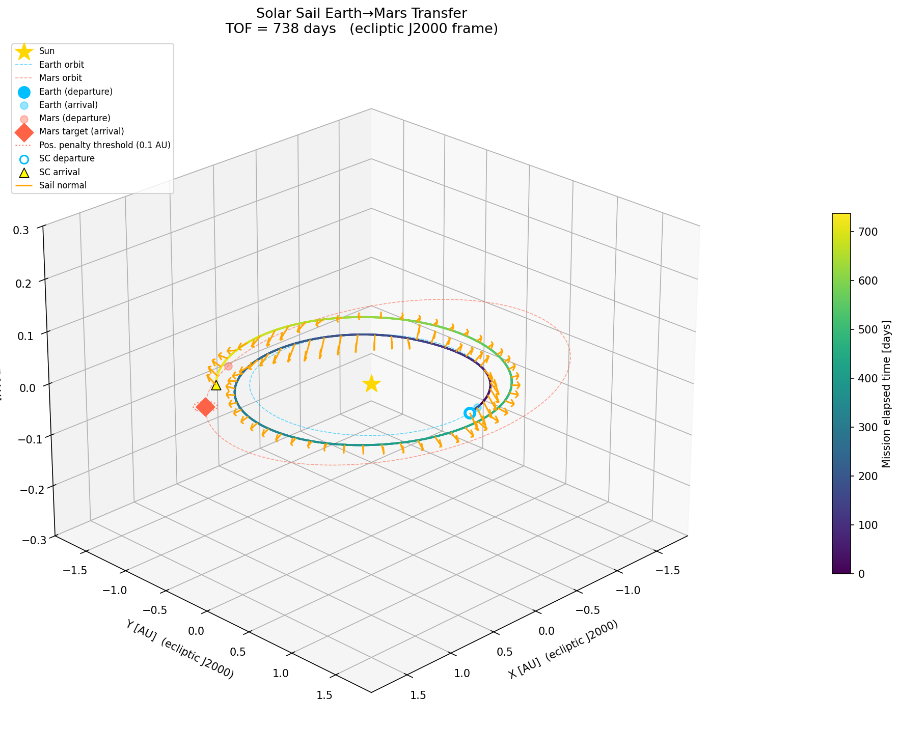
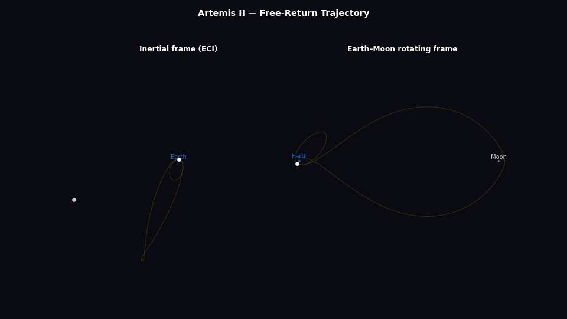
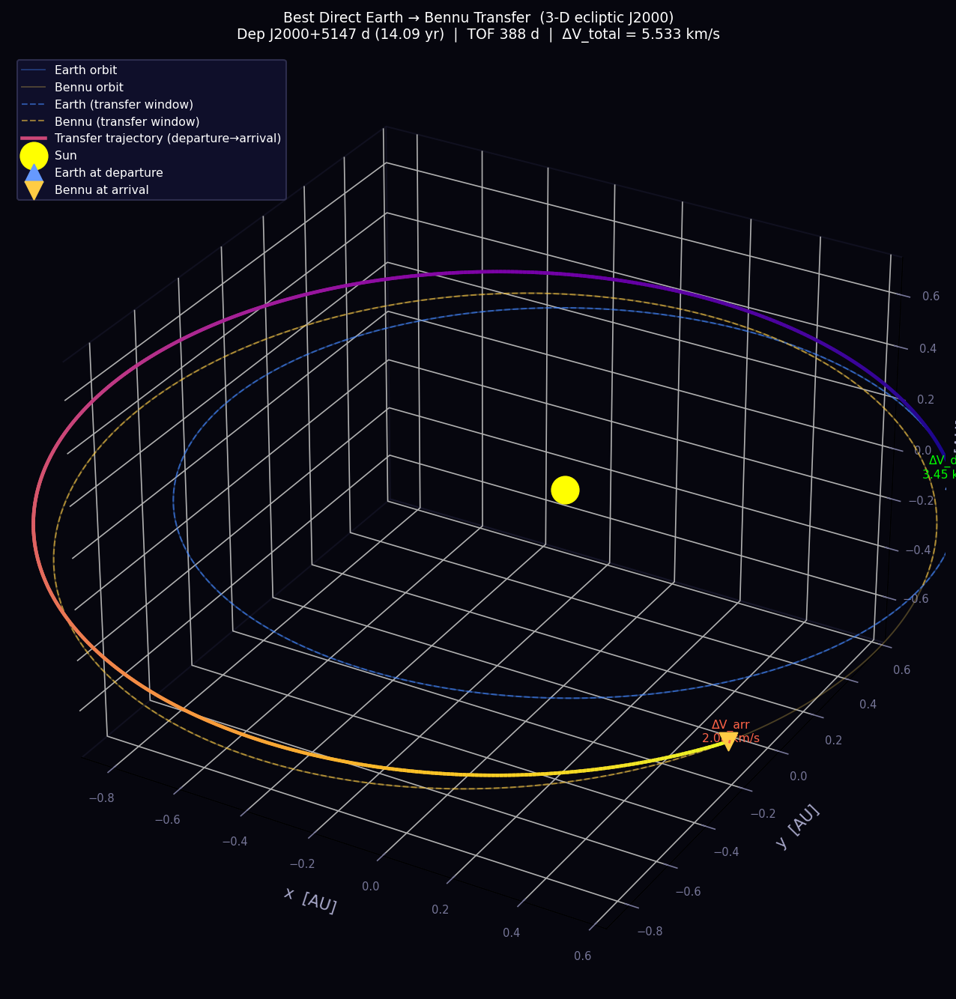
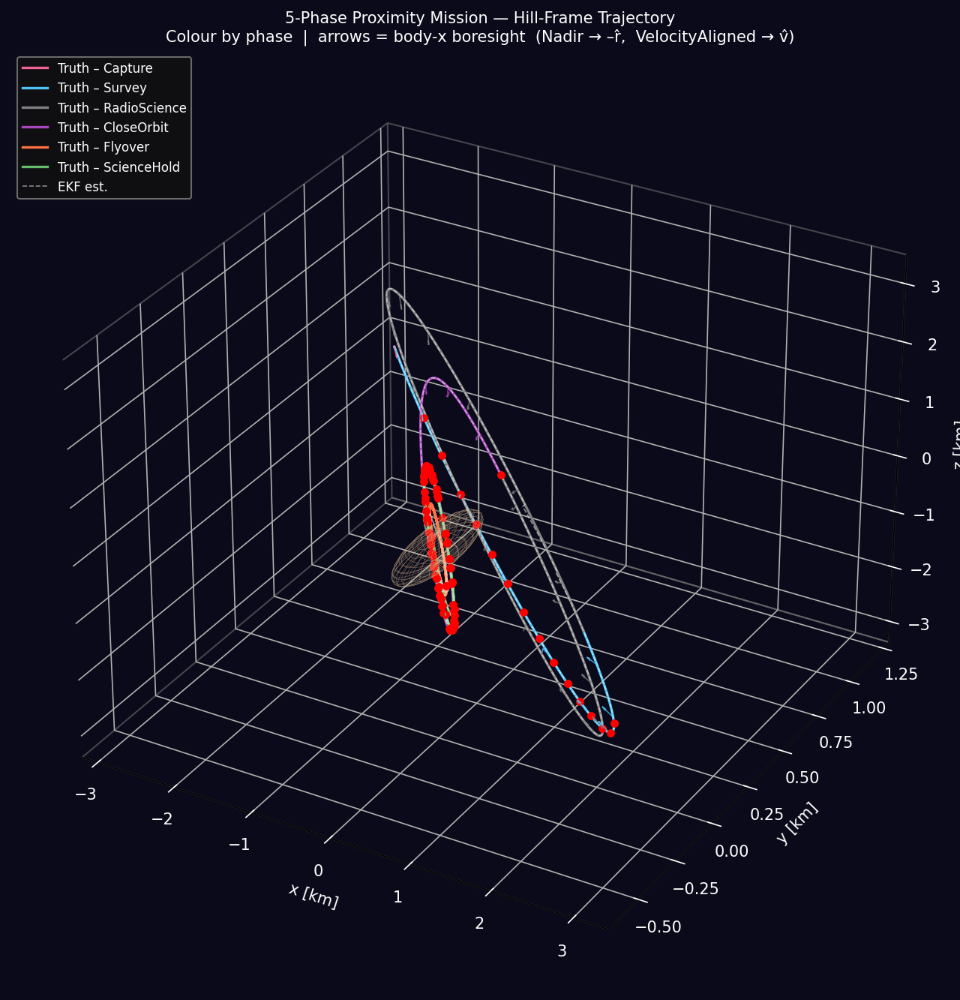
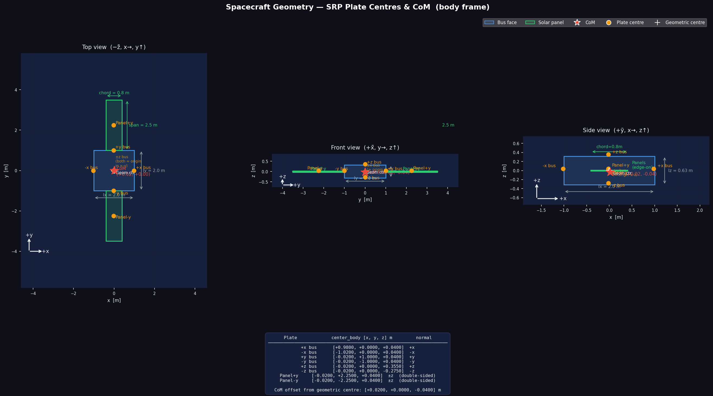

# AstroDynamics

Rust workspace for orbital mechanics simulation and trajectory optimisation.

---

## MissionPlanner — interplanetary mission design server

The largest and most recent part of this workspace: an Axum HTTP server (`cargo run --bin mission-server --release`) that powers the [AstroDynamics-UI](https://github.com/tjrotmans/AstroDynamics-UI) mission design frontend (screenshots there). I designed it to be able to go through an entire early phase mission planning sequence myself, without having to rely on other tools. This way I have full control over everything inside, plus I use this project to learn and investigate things I don't get to do in my day-to-day work. Although I base the physics engine inside on literature, actual mission data, and other tools, it's not yet strong enough for real mission planning. Further verification and validation need to be done, in the full breadth of the project, to ensure its reliability and correctness. But so far, I find it a pretty informative way to learn about space mission planning, and I hope it can help other engineers to learn about this process too: how to go from an initial trajectory to a real mission simulation with high-fidelity modelling, real mission constraints, and even simplified payloads and sensors.

This project is still under heavy development, many things are not perfect yet, many bugs remain, but feel free to raise issues when finding bugs. Also, feel free to independently validate the physics engine inside this repository by comparing trajectories, delta-v computations, mission timelines, etc. (I will add a way to export all data from a simulation for validation purposes). 

**Trajectory design**
- Closed-form Lambert porkchop grid search / Monte Carlo surveys over departure-date × time-of-flight windows
- Real-dynamics trajectory optimization: Genetic Algorithm, Particle Swarm, and a full **multi-gravity-assist (MGA) architecture** — Tisserand-graph flyby-sequence search, differential evolution + monotonic basin hopping over leg TOFs and deep-space maneuvers, multiple-shooting refinement under N-body dynamics. *Note: I tried to simplify MGA optimization by "just clicking on run and let it find the optimal way from A to B", but especially with multiple flybys the search space is so large and the optimal solutions are in such narrow bands, often near chaotic regions, that the (global) optimal solution is almost impossible to find without having prior knowledge or extreme computational power. There's a reason why MGA trajectory design is a complicated process cause it's a real art. I tried to automatically look for solutions using a Tisserand search before running the real optimization, but this is not always enough. Still I'm convinced there are ways to automate the design of such complex missions (I haven't tried applying AI), so feel free to come up with improvements.*
- Complete trajectory output: real propagated parking orbit or launch trajectory at departure, transfer arc (through actual SOI escape), and post-capture orbits or flybys
- Launch-vehicle feasibility against real flown-mission C3 performance curves (Falcon 9, Atlas V, Starship), launch-geometry solution (DLA/azimuth/coast) from the departure asymptote, and a two-pool (launcher vs. onboard) ΔV ledger
- Configurable force and torque models (third-body perturbations, SRP, zonal gravity harmonics (J2–J4), aerodynamics not implemented yet), integrators

**Vehicle & GNC design**
- Spacecraft configuration schema with real hardware placement (solar panels, RCS thrusters with position + direction, sensor/antenna boresights)
- Derived mass properties (CoM, inertia via parallel-axis over bus + placed components), per-plate SRP force vectors
- Actuator/sensor sizing (reaction wheels, propellant, EKF accuracy), closed-loop slew tests and Monte Carlo slew batches with acceptance criteria

**Closed-loop mission validation**
- Re-propagates the designed mission under 6DOF dynamics (translation + attitude + reaction wheels/RCS + guidance) against the Phase-1 reference trajectory
- GNC mode scheduling (prioritized pointing rules, mode-transition slews with settle/propellant reporting), TCM executive with Lambert-targeted corrective burns, main-engine burns with real thrust-offset disturbance torque
- Streams per-tick telemetry (attitude, pointing error, torque breakdown by source, wheel momentum, trajectory dispersion) over a job/stream/status/result API

API is documented in `docs/api/openapi.json` (the frontend generates its TypeScript types from it).

---

## Older, independent sub-projects that this workspace grew from — each self-contained and runnable

---

### OptimizationProblems — SA / GA optimization framework

A Rust (nightly) framework implementing **Simulated Annealing** and **Genetic Algorithm** optimization for low-thrust trajectories using solar and drag sails, with three trajectory examples:

| Example | Description |
|---|---|
| `solar_sail_trajectory` | Solar sail orbit raising using solar radiation pressure (ECI frame) |
| `drag_sail_trajectory` | Drag sail deorbitation (ECI frame) |
| `interplanetary_transfer` | Earth–Mars solar sail transfer (heliocentric frame, ANISE ephemeris) |



**Run an example:**
```bash
cargo run -p solar_sail_trajectory --release
cargo run -p drag_sail_trajectory --release
cargo run -p interplanetary_transfer --release
```

**Visualize results** (from the example directory):
```bash
python plot/plot_trajectory.py
python plot/plot_sa_vs_ga.py
```

---

### AstroProbs/LunarTrajectories — Low-energy lunar trajectory design (CRTBP)

Earth-Moon Circular Restricted Three-Body Problem framework for low-energy and manifold-based lunar trajectories.


**Capabilities:**
- Periodic orbit families: Lyapunov (L1/L2), Halo (north/south), Distant Retrograde Orbits — computed via differential correction + family continuation
- Invariant manifold branches from any found orbit (monodromy matrix eigendecomposition)
- Transfer design: direct Earth→orbit injection (Jacobi-targeted), manifold stitching via Poincaré sections
- Weak Stability Boundary (WSB) trajectories: grid search + refinement pipeline, high-fidelity propagation, circularisation targeting
- Comparison tools vs Artemis free-return trajectory

*10 example WSB captures*

https://github.com/user-attachments/assets/d3ee82aa-113c-44c2-a12e-a0d25328b3a3

*Sensitivity investigation*


**Binaries:**

| Binary | Purpose |
|---|---|
| `lunar_traj` | Demonstrate L1/L2 Lyapunov, Halo, DRO, manifolds, direct transfer |
| `find_orbits` | Systematic orbit family search |
| `find_transfers` / `improve_transfers` | Manifold-based transfer design |
| `wsb_pipeline` | Full WSB search → refine → circularise pipeline |
| `wsb_search/refine/sensitivity/maxhifi/circularize` | Individual WSB pipeline stages |
| `artemis_circularize` | Apply circularisation ΔV to Artemis trajectory |

**Run:**
```bash
cd AstroProbs/LunarTrajectories
cargo run --bin lunar_traj --release
python plot/plot_comparison.py
python plot/plot_manifolds.py
python plot/plot_wsb_pipeline.py
```

---

### AstroProbs/Artemis — Artemis 2 lunar free-return trajectory

High-fidelity Artemis 2 trajectory simulation in ECI (J2000), with full targeting and Monte Carlo tools.



**Physics model:** Earth point-mass gravity + J2–J4 zonal harmonics, Moon third-body, Sun third-body, solar radiation pressure (cannonball), ICPS finite burn (Tsiolkovsky variable mass).

**Three binaries:**

| Binary | Purpose |
|---|---|
| `artemis` | Simulate TLI burn + free-return coast, write `out/artemis2_trajectory.csv` |
| `target` | Multi-start differential correction — finds burn pitch/yaw/timing satisfying Moon flyby altitude, Earth-return perigee, and CA timing constraints |
| `mc` | Monte Carlo dispersions (N=1000) over burn parameters, saves top-100 solutions to `out/` |

**Typical workflow:**
```bash
cd AstroProbs/Artemis

# 1. Find burn angles (multi-start DC, prints each Newton iteration)
cargo run --bin target --release

# 2. Paste the printed values into src/config.rs, then simulate
cargo run --bin artemis --release

# 3. Monte Carlo dispersions
cargo run --bin mc --release

# Visualize
python plot/plot_eci_dashboard.py
python plot/plot_rotating.py
python plot/plot_mc_3d.py
```

> **Note:** requires `kernels/de440s.bsp` (~16 MB, not in git).  
> Download from `https://public-data.nyxspace.com/anise/de440s.bsp` and place in `AstroProbs/Artemis/kernels/`.

---

### GNC/AutonomousNavigation — Bennu full-mission GNC simulator

Full-mission GNC simulator for an asteroid sample-return mission modelled on OSIRIS-REx / Bennu geometry. Covers both the heliocentric cruise phase and full 6DOF proximity operations around Bennu.

**Binaries:**

| Binary | Purpose |
|---|---|
| `cruise_design` | Lambert + SRP porkchop plot, finds departure window and SRP-corrected nominal trajectory |
| `cruise_operations` | End-to-end cruise mission ops: truth propagation, ground OD (EKF-7), on-board EKF, TCM planning and execution |
| `proximity_ops` | Proximity phase: orbit insertion, 7-day station-keeping around Bennu with DSN updates |
| `proximity_mission` | 6-phase full proximity mission (Capture → Survey → CloseOrbit → Flyover → ScienceHold → RadioScience) |
| `mission` | End-to-end mission: cruise handoff → proximity operations |
| `autonav` | Standalone proximity navigation demo |

---

#### Cruise phase



**Physics model:**
- Heliocentric two-body Sun gravity + Solar Radiation Pressure (cannonball, `C_R` in state)
- SRP-corrected Lambert targeting via Newton shooting (`srp_shoot`)
- Ephemeris: Chebyshev polynomial fits for Earth and Bennu positions

**Navigation:**
- 7-state EKF (`[r_x, r_y, r_z, v_x, v_y, v_z, C_R]`) with full STM-based covariance propagation
- Analytical `∂r/∂C_R`, `∂v/∂C_R` column in STM (avoids catastrophic cancellation in FD)
- DSN two-way ranging (2 m noise) + range-rate (0.1 mm/s) at 2-hour cadence
- Ground OD tracks truth via ranging; on-board EKF receives daily hard-state uplinks from OD

**TCM targeting:**
- Numerical 3×3 Jacobian J = ∂r_arrival/∂v_now via ±0.5 m/s finite differences
- Minimum-norm ΔV: ΔV = J^T (J J^T)^{-1} b; B-plane threshold 500 km; earliest TCM Day 14
- Execution errors: 2% magnitude + 1.75% pointing (Gaussian)

```bash
cd GNC/AutonomousNavigation
cargo run --bin cruise_design --release
cargo run --bin cruise_operations --release
python plot/plot_cruise_ops.py
```

**Output (`out/cruise_ops/`):** `truth.csv`, `ground_od.csv`, `onboard_ekf.csv`, `tcm_log.csv`, `bplane_history.csv`, `body_tracks.csv`

---

#### Proximity phase



**Truth dynamics — 17-state 6DOF + reaction wheels:**
- State: `[r(3), v(3), q(4), ω(3), Ω_wheel(4)]`
- Integrator: RK4, configurable truth step (default 10 s)
- Translational perturbations: Bennu zonal gravity J2–J4 (Scheeres et al. 2020), SRP flat-plate model (6 bus faces + 2 solar panels), third-body Sun gravity
- Attitude: reaction wheel PD (primary, continuous) + RCS desaturation bang-bang couples (secondary)
- SRP: 8-plate flat-plate model (attitude-dependent force + torque), each plate with specular/diffuse optical properties



**Pointing:**
- Nadir mode: body +x → −r̂ (toward Bennu), body +z → orbit normal (r×v), eliminating 360°/orbit geometric-phase roll
- Rotation matrix → unit quaternion via Shepperd method

**Navigation — 10-state EKF with Gauss-Markov stochastic acceleration:**
- State: `[r(3), v(3), C_SRP, a_srp(3)]` where `a_srp` is a 3-axis Gauss-Markov stochastic acceleration
- Predict step: STM-based covariance propagation
- Sensor fusion: OpNav bearing + angular size, star tracker attitude, LIDAR range, landmark triangulation, DSN heliocentric uplinks

**Proximity mission phases (`proximity_mission` binary):**

| Phase | Orbit radius | Duration | Notes |
|---|---|---|---|
| Capture | — | variable | Orbit insertion from cruise handoff, transfer to 3 km |
| Survey | 3 km | 3 days | Mapping orbit |
| CloseOrbit | 900 m | 3 days | Science orbit |
| Flyover | 500 m | 2 days | Low-altitude passes |
| ScienceHold | 900 m | 2 days | Stable science hold |
| RadioScience | 3 km | variable | Quiescent SRP/gravity calibration arc |

```bash
cd GNC/AutonomousNavigation

# Full proximity mission
cargo run --bin proximity_mission --release
# Fast mode (larger steps):
cargo run --bin proximity_mission --release -- --dt 60 --meas-dt 600

# Station-keeping only
cargo run --bin proximity_ops --release

# Visualise
python plot/plot_mission.py
python plot/plot_mission_anim.py   # interactive HTML animation
python plot/plot_srp_anim.py       # SRP + attitude animation
python plot/plot_nav.py
python plot/plot_prox_ops.py
```

**Output (`out/mission/`):** `nav.csv`, `attitude.csv`, `maneuvers.csv`, `dsn_updates.csv`, `srp.csv`, `landmark_obs.csv`, `mission_anim.html`, `srp_animation.html`

---

## Workspace layout
Four top-level concerns share a common set of `crates/`:

```
AstroDynamics/
├── crates/
│   ├── orbital_math/        Vector math, angle normalisation
│   ├── orbital_models/      Gravity, SRP, drag, frame types, OrbitalElements
│   │   └── constants.rs     Single source of truth for all physical constants
│   ├── ephemeris/           ANISE DE440S ephemeris wrapper, BodyTrack interpolation
│   └── python/
│       └── astrodynamics.py Python mirror of orbital_models/constants.rs + frame utils
├── OptimizationProblems/    SA / GA framework + three trajectory examples
├── AstroProbs/
│   ├── LunarTrajectories/         CRTBP periodic orbits, manifolds, WSB transfers
│   └── Artemis/                   Artemis 2 lunar free-return simulation
│       ├── src/
│       │   ├── config.rs          Mission parameters
│       │   ├── propagator.rs      RK45 integrator (Dormand-Prince)
│       │   ├── orbit.rs           Initial state, burn direction
│       │   └── bin/
│       │       ├── target.rs      Targeting (multi-start DC)
│       │       └── mc.rs          Monte Carlo
│       └── plot/                  Python visualisation scripts
├── GNC/
│   └── AutonomousNavigation/      Bennu full-mission GNC simulator
│       ├── src/
│       │   ├── config.rs               All mission parameters (single source of truth)
│       │   ├── bin/
│       │   │   ├── cruise_design.rs        Lambert + porkchop
│       │   │   ├── cruise_operations.rs    Cruise mission ops
│       │   │   ├── proximity_ops.rs        Station-keeping around Bennu
│       │   │   ├── proximity_mission.rs    6-phase proximity mission
│       │   │   └── mission.rs              End-to-end (cruise → proximity)
│       │   ├── dynamics/               6DOF truth propagator (RCS, SRP, attitude, Bennu gravity)
│       │   ├── navigation/             EKF (10-state Gauss-Markov) + STM
│       │   ├── guidance/               Pointing modes (nadir + orbit-normal, velocity-aligned)
│       │   ├── sensors/                OpNav, star tracker, LIDAR, IMU, landmark, DSN
│       │   └── actuators/              Reaction wheels
│       ├── plot/                       14 Python visualisation scripts
│       └── out/                        cruise/, cruise_ops/, mission/, prox_ops/
└── crates/
    ├── orbital_math/
    ├── orbital_models/
    └── ephemeris/
│   ├── Artemis/             Artemis 2 high-fidelity free-return simulation
│   └── LunarTrajectories/   Earth-Moon WSB + heteroclinic transfer library
```

> **Kernel required:** `kernels/de440s.bsp` (~16 MB, not in git).  
> Download: `https://public-data.nyxspace.com/anise/de440s.bsp`  
> Place in both `AstroProbs/Artemis/kernels/` and `AstroDynamics/kernels/`.
>
> **Optional satellite kernels** (`AstroDynamics/kernels/` only) add ANISE ephemeris
> coverage for Phobos/Deimos, Europa, and Titan to `/api/bodies/{name}/state` and
> `MissionPlanner`'s `anise_body()`. Each is independently optional — missing one only
> drops coverage for that system's moons, it doesn't break anything else:
> | Kernel | Adds | Size | Source |
> |---|---|---|---|
> | `mar099s.bsp` | Phobos, Deimos | ~68 MB | `https://naif.jpl.nasa.gov/pub/naif/generic_kernels/spk/satellites/mar099s.bsp` |
> | `jup365.bsp` | Europa | ~1.1 GB | `https://naif.jpl.nasa.gov/pub/naif/generic_kernels/spk/satellites/jup365.bsp` |
> | `sat441.bsp` | Titan | ~660 MB | `https://naif.jpl.nasa.gov/pub/naif/generic_kernels/spk/satellites/sat441.bsp` |

---

## crates/ — shared physics library

All constants, models, and frame utilities live here. **Never redefine them in application code.**

| Crate | Key exports |
|---|---|
| `orbital_math` | `Vector`, `normalize` |
| `orbital_models` | `GravityModel` (J2–J4, 3rd-body, SRP), `OrbitalElements`, `StateVector`, `AtmosphereModel`, `FiniteBurn`, `constants::*` |
| `ephemeris` | `Almanac`, `BodyTrack`, `MoonTrack`, `SunTrack`, `Epoch`, frame phantom types |
| `crates/python/astrodynamics.py` | Python mirror — all constants + `rot_em_to_eci`, `moon_em_to_eci`, `orbital_plane_r3d`, `eci_to_rot_em` |

### Key constants (`crates/orbital_models/src/constants.rs`)

| Constant | Value | Unit |
|---|---|---|
| `MU_EARTH` | 3.986004418 × 10¹⁴ | m³/s² |
| `MU_MOON` | 4.9048695 × 10¹² | m³/s² |
| `MU_SUN` | 1.327124400 × 10²⁰ | m³/s² |
| `EARTH_RADIUS` | 6.371 × 10⁶ | m |
| `MOON_RADIUS` | 1.7374 × 10⁶ | m |
| `P_SRP` | 4.56 × 10⁻⁶ | N/m² |
| `AU` | 1.496 × 10¹¹ | m |
| `J2` | 1.082626 × 10⁻³ | — |

---

## OptimizationProblems — SA / GA framework

Simulated Annealing and Genetic Algorithm optimiser with three trajectory examples:

| Example | Description |
|---|---|
| `solar_sail_trajectory` | Solar sail orbit raising (ECI, SRP) |
| `drag_sail_trajectory` | Drag sail deorbitation (ECI) |
| `interplanetary_transfer` | Earth–Mars solar sail transfer (heliocentric, ANISE) |

```bash
cargo run -p solar_sail_trajectory --release
cargo run -p interplanetary_transfer --release
python plot/plot_trajectory.py
```

---

## AstroProbs/Artemis — Artemis 2 free-return trajectory

High-fidelity Artemis 2 simulation in ECI (J2000).

**Physics:** Earth point-mass + J2–J4, Moon and Sun third-body, SRP (cannonball), ICPS finite burn (Tsiolkovsky).

| Binary | Purpose |
|---|---|
| `artemis` | TLI burn + free-return coast → `out/artemis2_trajectory.csv` |
| `target` | Multi-start differential correction (pitch, yaw, burn timing) |
| `mc` | Monte Carlo dispersions N=1000, saves top 100 solutions |

```bash
cd AstroProbs/Artemis
cargo run --bin target --release      # find burn angles → paste into config.rs
cargo run --bin artemis --release     # simulate
cargo run --bin mc --release          # Monte Carlo
python plot/plot_eci_dashboard.py
```

---

## AstroProbs/LunarTrajectories — Earth-Moon transfer library

Two independent transfer methods share one Rust library:

### Branch A — WSB ballistic transfers (BCR4BP)

**Dynamics:** Bicircular Restricted 4-Body Problem (Earth-Moon-Sun rotating frame).  
**Entry point:** `wsb_pipeline` — runs the full pipeline end-to-end.

```bash
cd AstroProbs/LunarTrajectories
cargo run -p lunar_trajectories --bin wsb_pipeline --release
```

**Pipeline stages:**

| Step | Binary | Purpose |
|---|---|---|
| 1 | `wsb_search` | 4-phase global seed search (backward/forward screening, Pareto analysis) |
| 2 | `wsb_optimize` | Island GA over (θ, θ_sun, r_apogee) |
| 3 | `wsb_refine` | Monte Carlo local polish (1 000 samples/seed) |
| 4 | `wsb_maxhifi` | Maximum-fidelity Dopri5 repropagation (rtol=1e-10) |
| 5 | `wsb_circularize` | LOI burn + BCR4BP → ECI frame conversion (DE440S) |
| 6 | `wsb_continuation_corrected` | Homotopy λ=0→1: BCR4BP → real ANISE ephemeris with shooting correction |

**Step 6 in detail (`wsb_continuation_corrected`):**
- Finds a real calendar epoch where the Sun-Moon phase matches the BCR4BP solution
- Aligns the BCR4BP orbital plane to the real Moon's inclined orbit (R3D matrix)
- Homotopy λ ∈ {0, 0.25, 0.5, 0.75, 1.0}: blends circular → real ephemeris
- At each λ, shooting correction in (θ, r_apogee) keeps the trajectory in the Hill sphere
- Score function rejects direct transfers (<20 days), Moon crashes, large LOI ΔV increases
- Prints BCR4BP vs real-ephemeris LOI ΔV comparison and TLI departure date

```bash
# Default (solution index 0, best epoch 2000-2030):
cargo run -p lunar_trajectories --bin wsb_continuation_corrected --release

# Specific solution index and year:
cargo run -p lunar_trajectories --bin wsb_continuation_corrected --release -- --idx 2 --year 2026
```

**Optional diagnostics (run after wsb_refine):**

| Binary | Purpose |
|---|---|
| `wsb_sensitivity` | 200-sample perturbation ensemble |
| `wsb_sensitivity_individual` | One-at-a-time parameter sweep |
| `wsb_stats` | 20 000-sample sigma-sweep statistics |
| `wsb_basin` | Capture-basin grid (θ × θ_sun) |
| `wsb_dense_traj` | Dense trajectories for 10 diverse solutions |

**Visualisation:**

```bash
cd plot
python wsb_plots.py                          # master orchestrator
python plot_wsb_continuation_anim.py        # IC convergence animation (real ephemeris)
python plot_wsb_continuation_eci.py         # ECI homotopy steps
```

---

### Branch B — Heteroclinic/homoclinic connections (CRTBP)

**Dynamics:** Pure 3-D CRTBP (Earth-Moon, no Sun).  
**Method:** Differential correction → monodromy matrix → invariant manifolds → Poincaré section matching.

```bash
cargo run -p lunar_trajectories --bin lunar_traj --release  # demo
cargo run -p lunar_trajectories --bin find_orbits --release
cargo run -p lunar_trajectories --bin find_transfers --release
cargo run -p lunar_trajectories --bin improve_transfers --release
python plot/plot_transfers.py
```

---

## Python constants — `crates/python/astrodynamics.py`

All Python visualisation scripts import physical constants and frame-rotation utilities from this single file, which mirrors `crates/orbital_models/src/constants.rs` exactly. **Do not redefine constants in individual scripts.**

```python
import sys, pathlib
sys.path.insert(0, str(pathlib.Path(__file__).resolve().parents[N] / "crates" / "python"))
from astrodynamics import MU_ND, L_KM, T_STAR, rot_em_to_eci, orbital_plane_r3d
```

All WSB plot scripts import via `wsb_style.py`, which already handles the path setup.
