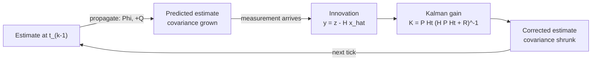

# AstroDynamics Technical Manual — Part I: Orbital Mechanics, Guidance, Navigation, and Control

## Preface

This is the first part of what is meant to become a complete technical
manual for AstroDynamics, the trajectory-design and mission-simulation tool
built in this repository. The manual states the physics and mathematics
behind every model, control law, and estimator the tool implements. Each
section names the source file that implements it, so the manual doubles as
a map from physics to code. Later parts will cover mission architecture,
hardware sizing, and trajectory-design-specific material (multi-gravity-
assist search, low-thrust optimization) not repeated here even though some
of it shares the propagation math in §2.

This document documents the tool as it actually is, including
simplifications made deliberately and limitations found during testing.
Where a model is simplified, or a real limitation was found, that is
stated plainly.

---

## 1. Conventions and Reference Frames

### 1.1 Vector and frame notation

Every vector quantity in this document is written with its frame of
resolution as a trailing subscript, separated by a vertical bar:

```text
v|F  =  the vector v, expressed in the coordinate axes of frame F
```

Two frames are used throughout: the inertial frame **ICRF** (§1.2) and the
spacecraft body frame **SBCF** (§1.3), so a vector appears as either
`v|ICRF` or `v|SBCF`. Angular velocity `ω` is, by physical definition,
always resolved in the body frame — every rate gyro measures body-frame
rate, and the spacecraft's inertia tensor is only constant in the body
frame — so its subscript is dropped once stated, restored only where an
equation mixes frames explicitly. This mirrors standard usage in the
references cited throughout (Markley & Crassidis, Vallado): fix the frame
for a derivation, state it once, and only re-mark it where ambiguity
would otherwise arise.

Subscripts denoting physical meaning (e.g. `τ_c` for control torque,
`τ_p` for perturbation torque, `a_srp` for solar-radiation-pressure
acceleration) are independent of, and compose with, the frame notation —
for example `τ_p|SBCF` is "the perturbation torque, resolved in body-frame
components."

### 1.2 The inertial frame — ICRF

The inertial frame used throughout this tool is the **International
Celestial Reference Frame** (ICRF), realized in this codebase via its
JPL/ANISE "J2000" orientation constant — for the accuracy this tool works
at, ICRF and the classical mean-equator-and-equinox-of-J2000 frame are
interchangeable (they agree to sub-arcsecond precision). Its axes:

```text
Ẑ_ICRF   points toward the north celestial pole (J2000 epoch)
X̂_ICRF   points toward the J2000 mean vernal equinox
Ŷ_ICRF   completes a right-handed set:  Ŷ_ICRF = Ẑ_ICRF × X̂_ICRF
```

```text
                 Ẑ_ICRF
                  ▲
                  │
                  │
                  o───────► Ŷ_ICRF
                 ╱
                ╱
          X̂_ICRF
   (origin: center of whichever body is
    currently central — see §1.5)
```

ICRF axes never rotate — they are fixed, by definition, for the lifetime
of a simulation. This is what makes it usable as *the* inertial frame:
Newton's laws, and every equation of motion in this document, are stated
in an inertial (non-rotating, non-accelerating) frame. This should not be
confused with the body-centered *rotating* Hill/RTN frame used elsewhere
in this repository for three-body work (§1.5 covers the one thing that
does change: which point in space is called the origin).

### 1.3 The spacecraft body frame — SBCF

The **Spacecraft Body-Centered Frame** (SBCF) is fixed to, and rotates
with, the spacecraft. Its origin is the spacecraft's own center of mass.
Its axes are not fixed by physical law — a spacecraft's own designer
chooses which physical direction each body axis points — but this tool
fixes a **default convention**, followed by every reference mission and
every pointing mode unless a mission's own hardware placement says
otherwise:

```text
SBCF +x   the primary payload/boresight axis — thrust direction, camera/
          antenna boresight, target-relative pointing (§9.3) all default
          to +x, the same convention already documented for `BurnAttitude`/
          `EarthComm`/`TargetRelative`.
SBCF +z   the solar-panel axis — the automatic bus+panel SRP geometry
          (§4.2) mounts panels normal to +z, and `SunPointing` (§9.3)
          holds +z toward the Sun.
```

This is a default, not a hardwired physical constraint: any placed piece
of hardware (a sensor boresight, a comm-antenna direction, a custom
panel's own normal) can be given an explicit direction of its own in the
mission configuration, and the attitude commander then points *that*
direction, not a fixed body axis (§9.4). The `+z` panel default in
particular is the one most commonly relaxed in practice — an articulated
solar-array drive mechanism can decouple the panel's own Sun-tracking
from the body's `+z` axis entirely, freeing that degree of freedom for
other uses (§9.5). The default exists so a mission that does not need
that flexibility does not have to declare hardware placements just to get
sensible pointing behavior; it is not a claim that `+x`/`+z` mean
anything physically special about a spacecraft.

```text
                 Ẑ_SBCF
                  ▲
                  │
                  │
                  o───────► Ŷ_SBCF
                 ╱
                ╱
          X̂_SBCF
   (origin: spacecraft center of mass;
    rotates with the vehicle — R(q) below
    carries SBCF axes into ICRF)
```

The rotation carrying a vector from SBCF into ICRF is exactly the
attitude quaternion's own action (§6.1–§6.2):

```text
v|ICRF = R(q) · v|SBCF
```

`I = diag(Ixx, Iyy, Izz)` (§6.4) is constant only when expressed in SBCF —
this is, in fact, part of *why* SBCF is defined the way it is: its axes
are chosen to be the spacecraft's own principal axes of inertia wherever
the mass distribution allows it.

### 1.4 Origin translation when the central body switches

The propagator (§2.3) periodically switches which body is treated as
gravitationally "central," to keep the spacecraft always described
relative to the nearest dominant mass. This changes only the coordinate
**origin**, never the frame's **orientation** — ICRF axes point the same
fixed direction in space regardless of which body's center is called
`(0,0,0)`. If the central body switches from body `A` to body `B` at
time `t*`, then for `t ≥ t*`:

```text
r|ICRF,about B (t)  =  r|ICRF,about A (t)  −  r_B|ICRF,about A (t)
v|ICRF,about B (t)  =  v|ICRF,about A (t)  −  v_B|ICRF,about A (t)
```

where `r_B|ICRF,about A`, `v_B|ICRF,about A` are body `B`'s position and
velocity relative to body `A`, read directly from the ephemeris at the
switch time. There is no rotation matrix in this transformation — it is a
pure vector subtraction, an origin shift only, because the same fixed
ICRF axes are used on both sides of the switch:

```text
     ICRF axes (identical orientation on both sides)

       Ẑ                              Ẑ
       │                              │
  A ───o───► Ŷ                   B ───o───► Ŷ
      ╱                              ╱
     ╱                              ╱
    X̂                              X̂

   r|ICRF,about B  =  r|ICRF,about A  −  r_B|ICRF,about A
```

The switching criterion itself — the Laplace sphere of influence — is
covered together with the rest of the propagation math in §2.3.

### 1.5 Units and sign conventions

SI throughout: meters, seconds, kilograms, radians. Where a hardware
datasheet quotes a figure in another convention (deg/hr for gyro bias
stability, arcseconds for star-tracker accuracy), the conversion to SI
happens once, at the point the figure enters the code
(`hardware_catalog`), never repeated ad hoc.

---

## 2. Orbital Mechanics and Numerical Propagation

### 2.1 The two-body problem

Every trajectory in this tool begins from the same starting point:
Newton's law of gravitation and Newton's second law, applied to two point
masses — a central body of mass `M` and a spacecraft of mass `m`. Writing
each body's absolute equation of motion in an inertial frame and
subtracting one from the other (the standard "relative motion" reduction;
Vallado, *Fundamentals of Astrodynamics and Applications*, ch. 2) gives
the equation of motion for the spacecraft's position `r` relative to the
central body:

```text
r̈|ICRF  =  − μ / r³ · r|ICRF,          μ = G(M + m) ≈ GM   (since m ≪ M)
```

with `r = |r|ICRF|`. This single vector equation is the foundation
everything else in this manual builds on.

**Conserved quantities.** Because the force is purely radial (central), the
specific angular momentum `h = r × v` is conserved:

```text
ḣ = ṙ × v + r × v̇ = v × v + r × (−μ/r³ r) = 0
```

(the first cross product vanishes because `v × v = 0`; the second because
`r × r = 0`). A conserved `h` means the motion is confined to a fixed plane
(the orbital plane, normal to `h`) and sweeps out equal areas in equal
times — Kepler's second law. Specific mechanical energy is likewise
conserved for this conservative force field:

```text
ε = v²/2 − μ/r = − μ / (2a)         (a = semi-major axis)
```

which rearranges into the **vis-viva equation**, the single most-used
relation in orbital mechanics for relating speed to position:

```text
v² = μ (2/r − 1/a)
```

**Shape of the orbit.** Solving the radial equation of motion (the
standard substitution `u = 1/r`; see Vallado ch. 2 or Curtis, *Orbital
Mechanics for Engineering Students*, ch. 2, for the full derivation) shows
the trajectory is a conic section:

```text
r(ν) = p / (1 + e cos ν),          p = h² / μ  (semi-latus rectum)
```

parameterized by eccentricity `e` and true anomaly `ν`. A full state
`(r, v)` — six numbers — is equivalent to six **classical orbital
elements** `(a, e, i, Ω, ω, ν)`: semi-major axis, eccentricity,
inclination, right ascension of the ascending node, argument of periapsis,
and true anomaly. This tool works primarily in Cartesian `(r, v)` state
vectors rather than orbital elements, because perturbed motion (§2.2) is
not itself a Kepler orbit and does not have constant elements — elements
are used only where the trajectory-design layer needs them (e.g.
launch-vehicle C3 sizing), not by the propagator itself.

### 2.2 Perturbed motion — Cowell's method

The two-body equation of §2.1 is exact only for two isolated point
masses. A real spacecraft also feels gravitational harmonics, third
bodies, radiation pressure, drag, and thrust (§3–§5). This tool integrates
the **full, perturbed, nonlinear equation of motion directly in Cartesian
coordinates** — Cowell's method, the simplest and most general numerical
propagation technique (contrasted with Encke's method, which propagates
only the deviation from a fixed reference Kepler orbit and periodically
"rectifies" that reference; not used in this tool):

```text
r̈|ICRF  =  − μ/r³ · r|ICRF  +  a_p|ICRF
```

where `a_p` is the sum of every perturbing acceleration active for the
current force-model configuration (§3, §4). Written as a first-order
system in the state `x = [r; v] ∈ ℝ⁶`, this is what is actually handed to
the numerical integrator (§2.4):

```text
ẋ = f(t, x) = [  v  ;  −μ/r³ r + a_p(t, r, v)  ]
```

`crates/trajectory_solver/src/propagator.rs::propagate` implements exactly
this — every trajectory-design solver (Hohmann, Lambert, differential
correction, MGA, the optimizers) and the translational half of the 6DOF
simulation (§7) call the same function, so trajectory design and GNC
simulation are provably using the same dynamics, not two independent
implementations that could silently disagree.

### 2.3 Central-body switching — patched conics

Which body is "central" (dominates the `−μ/r³ r` term above) changes as
the spacecraft moves — near Earth, Earth's gravity dominates; near the
Moon, the Moon's does. The propagator switches central body whenever the
spacecraft crosses a body's **Laplace sphere of influence**, the standard
patched-conic boundary (Vallado):

```text
R_SOI = a_body · (m_body / m_central)^(2/5)
```

where `a_body` is the perturbing body's own orbital semi-major axis about
whatever it orbits, and `m_body`/`m_central` are the two bodies' masses.
When the spacecraft's distance from a candidate body drops below that
body's `R_SOI`, that body becomes central — and if the spacecraft is
simultaneously inside more than one body's sphere (e.g. near the Moon,
inside both the Moon's and Earth's), the *smallest* containing sphere
wins. The coordinate transformation performed at the switch is exactly
§1.4's origin shift — nothing else changes.

### 2.4 Numerical integration

**The general Runge-Kutta family.** Given `ẋ = f(t, x)`, an explicit
`s`-stage Runge-Kutta step from `(t_n, x_n)` to `(t_n + h, x_{n+1})` is

```text
k_i = f( t_n + c_i h,  x_n + h Σ_{j<i} a_ij k_j )      i = 1..s
x_{n+1} = x_n + h Σ_i b_i k_i
```

fully specified by its Butcher tableau `(c, A, b)`. The classical `RK4`
(4 stages, 4th-order accurate, fixed step) is the textbook baseline and is
available in this tool for cases that want a fixed, predictable step
count (bulk Monte Carlo sweeps where per-run cost must be bounded and
uniform).

**Embedded (adaptive) Runge-Kutta.** The propagator's default is an
adaptive-step method, **Dormand-Prince 5(4)** (Dormand & Prince, 1980),
which computes *two* solution estimates of different order from the
*same* set of stage evaluations — a 5th-order estimate `x_{n+1}` used to
advance the state, and a 4th-order estimate `x*_{n+1}` used only to judge
accuracy:

```text
e_{n+1} = x_{n+1} − x*_{n+1}                     (free local-error estimate)
h_{n+1} = h_n · safety · ( tol / |e_{n+1}| )^{1/(p+1)}     (p = 4)
```

If `|e_{n+1}|` exceeds the requested tolerance, the step is rejected and
retried with the smaller `h_{n+1}`; otherwise it is accepted and the
(generally larger, if the local dynamics were smooth) `h_{n+1}` is used
for the next step. This single mechanism is why a quiet interplanetary
coast takes only one or two large steps per tick, while a close flyby or
an active burn automatically refines its own step size, with no
per-phase manual tuning anywhere in this codebase — the step-size
controller is doing exactly the job described here, not a heuristic
layered on top of it.

**Why an explicit method is the right choice here.** Explicit
Runge-Kutta methods can become inefficient — forced to very small steps
regardless of the requested accuracy — for *stiff* systems, where widely
separated time scales coexist in the same equations (a fast, tightly
damped mode alongside a slow one). Ordinary orbital and (under active
attitude control) rotational dynamics in this tool are not stiff, so an
explicit adaptive method is appropriate and efficient; an implicit method
(Radau — already a selectable integrator in this codebase's
configuration schema) would only be needed if a genuinely stiff regime
were encountered, and is kept available for that reason rather than used
by default. Reference: Hairer, Nørsett & Wanner, *Solving Ordinary
Differential Equations I: Nonstiff Problems*.

**The control tick, layered on top.** GNC simulation (§7 onward) needs one
more idea beyond ordinary propagation: a **zero-order-hold control tick**.
The commanded torque and reaction-wheel momentum are held fixed for the
duration of one tick; *within* that tick, the adaptive integrator above
runs exactly as described, taking as many or as few internal steps as the
dynamics demand. Tick length is a control-bandwidth choice (§10), whereas
internal step size within a tick is purely an accuracy choice — the two
are governed by different considerations and should not be confused.

---

## 3. Gravitational Perturbations

### 3.1 Point mass

Restated from §2.1 for reference — this is the leading term every other
gravity model in this section adds a correction on top of:

```text
a|ICRF = −μ/r³ · r|ICRF
```

`orbital_models::GravityModel::point_mass`, generic over any body's `μ`.

### 3.2 Zonal spherical harmonics

A real body is not a perfect point mass or sphere — its gravitational
potential is more accurately represented by an expansion in spherical
harmonics. For a body whose mass distribution is axisymmetric about its
own rotation axis (no dependence on longitude — the standard, adequate
approximation for the bodies this tool models), the expansion reduces to
its **zonal** terms only:

```text
U(r, φ) = μ/r  ·  [ 1  −  Σ_{n=2}^{∞} J_n (R_e/r)^n P_n(sin φ) ]
```

where `r` is distance from the body's center, `φ` is latitude measured
from the body's equatorial plane, `R_e` is the body's equatorial
(reference) radius, `J_n` are dimensionless zonal harmonic coefficients
(determined empirically from tracking data for each body), and `P_n` are
the ordinary Legendre polynomials:

```text
P_2(x) = ½ (3x² − 1)
P_3(x) = ½ (5x³ − 3x)
P_4(x) = ⅛ (35x⁴ − 30x² + 3)
```

`J_2` — oblateness, the equator bulging relative to the poles — is by far
the dominant term for every body modeled in this tool (order `10⁻³`,
against `10⁻⁶` for `J_3` and `J_4`); `J_3` and `J_4` are kept for
completeness (a north-south asymmetry and a second symmetric correction,
respectively) but contribute a small fraction of `J_2`'s effect over any
mission timescale this tool targets. The acceleration is `a = −∇U`;
carried out in body-fixed Cartesian coordinates `(x, y, z)`, `r² = x²+y²+z²`,
the closed forms actually implemented (`orbital_models::acceleration::
gravity::{zonal_j2_body, zonal_j3_body, zonal_j4_body}`) are:

```text
J2:   k₂ = 3/2 · J2 μ Re² / r⁵
      ax = k₂ x (5z²/r² − 1)
      ay = k₂ y (5z²/r² − 1)
      az = k₂ z (5z²/r² − 3)

J3:   kxy = −5/2 · J3 μ Re³ z / r⁷,    kz = J3 μ Re³ / (2 r⁹)
      ax = kxy x (3 − 7z²/r²)
      ay = kxy y (3 − 7z²/r²)
      az = kz  (3r⁴ − 30 z² r² + 35 z⁴)

J4:   k₄ = J4 μ Re⁴ / r⁷
      ax = 15/8 · k₄ x (1 − 14 z²/r² + 21 z⁴/r⁴)
      ay = 15/8 · k₄ y (1 − 14 z²/r² + 21 z⁴/r⁴)
      az =  5/8 · k₄ z (15 − 70 z²/r² + 63 z⁴/r⁴)
```

**Frame requirement.** These formulas are only correct when `(x, y, z)` is
already expressed in a frame whose `z`-axis is the body's true rotational
pole — for Earth, ICRF `z` *is* the pole (to the precision needed here),
so the formula applies directly in ICRF; for every other body, whose pole
is tilted relative to ICRF, the position vector must first be rotated
into a pole-aligned frame, the formulas above applied there, and the
resulting acceleration rotated back:

```text
p̂ = pole direction (from the body's own right-ascension/declination, ICRF)
{û, v̂, p̂} = any right-handed orthonormal basis with p̂ as its third axis
r|pole-frame = ( r·û, r·v̂, r·p̂ )
a|ICRF = û aₓ,pole-frame + v̂ ay,pole-frame + p̂ az,pole-frame
```

(`GravityModel::zonal_harmonics_body_oriented`). The choice of `û, v̂`
within the plane perpendicular to the pole is arbitrary — the potential
above has no longitude dependence, so any consistent right-handed choice
round-trips to the same physical acceleration vector.

Reference: Montenbruck & Gill, *Satellite Orbits*, §3.2; Vallado, ch. 8.

### 3.3 Third-body perturbation

A perturbing body (the Sun, for an Earth-centered problem; Earth, for a
lunar-centered one; any planet, for a heliocentric leg) pulls on both the
spacecraft *and* on the central body itself. Because the working frame is
centered on the (accelerating) central body rather than on a true inertial
origin, the perturbation the spacecraft actually feels is the **difference**
between the direct pull on the spacecraft and the pull on the central body
— the *indirect term* (Battin, *An Introduction to the Mathematics and
Methods of Astrodynamics*; Vallado ch. 8):

```text
a_3rd = μ_3rd  [  (r_3rd − r) / |r_3rd − r|³   −   r_3rd / |r_3rd|³  ]
```

where `r` is the spacecraft's position and `r_3rd` is the perturbing
body's position, **both measured relative to the same central body** (from
the ephemeris). The first bracketed term is the direct pull of the third
body on the spacecraft; the second is the reaction correction for the
central body's own acceleration. Both position vectors here are small —
of order the spacecraft-to-central-body and perturber-to-central-body
distances, never the full heliocentric-scale absolute position — which is
what keeps this formula numerically well-conditioned: it never subtracts
two independently large, nearly-equal absolute position vectors (a naive
`r_sc,heliocentric − r_perturber,heliocentric` subtraction would, at
heliocentric distances, lose many significant digits to floating-point
cancellation before the physically-relevant difference is even reached).
`orbital_models::GravityModel::third_body`.

**Layer 2 (the cruise loop, §9.1) reuses this exact formula and code path**
— `sim_engine::step_tick`'s translational integration is a direct call into
`trajectory_solver::propagate`, the same SOI-patched propagator Layer 1
uses, not a separate implementation. The only real difference is where the
perturbing body's ephemeris comes from: Layer 1 queries a live ANISE
`Almanac`; the cruise loop (deliberately kept ANISE-free, §9.1) takes
precomputed `(t, r)` samples from `cruise_seed.body_tracks` instead
(`cruise::build_body_track_perturbers`, added 2026-08-18) — a caller with
Almanac access (a demo binary, a future route handler) supplies the track,
the cruise loop just interpolates it.

Every registered body-track perturber is third-body-only (`soi_radius_m =
None` in the propagator's own terms) — never a central-body-switching
candidate — **by default only**, since 2026-08-18. `BodyTrackConfig::
soi_capture: true` opts a specific track into being a real SOI-switching
central-body candidate too, sized via the exact same Laplace-sphere formula
as Layer 1's `design::propagator_body_entries` (§3.1, "Central body's
gravity fidelity"): `R_SOI = a · (μ_body / μ_primary)^(2/5)`, with `a`
resolved from the track's own first sample (heliocentric distance when the
body's catalog `primary` is `None`, e.g. Mercury; distance from the
primary's OWN body-track when `primary` is set and that track is also
supplied, e.g. the Moon needs distance from Earth, falling back to
heliocentric distance with a printed warning if the primary's track is
absent — the same wrong-primary failure mode §7k/Phase 8h already fixed
once for Layer 1). This closed a real gap: without it, the cruise loop's
propagated TRUTH stayed under Sun-only central gravity even through a
close approach that the *reference* trajectory (built from a real Phase-01
result) correctly showed as a captured orbit — the truth simply never
switched central body, so dispersion against that reference grew as if the
spacecraft had flown straight through instead of capturing. No central-body
zonal-harmonic fidelity is applied to a `soi_capture` track (point-mass
only) — cruise.rs has no per-track gravity-model config the way Layer 1's
`target_body.gravity_model` provides one; a fidelity dial here would be a
future addition, not a correctness requirement.

---

## 4. Solar Radiation Pressure

Radiation pressure at distance `r` from the Sun follows an inverse-square
law from its value at a reference distance:

```text
P(1 AU) = S / c                    (S = solar constant, c = speed of light)
P(r)    = P(1 AU) · (AU / r)²
```

Two models of how this pressure couples into spacecraft dynamics are
implemented, trading fidelity for attitude-independence.

### 4.1 Cannonball model

The spacecraft is idealized as a sphere: one effective area `A`, one
scalar reflectivity coefficient `C_R` (`= 1` perfect absorber, `≈ 2`
perfect specular reflector; SMAD's typical mixed-surface range is
1.2–1.5, the default used throughout this tool). Acceleration is always
directed along the spacecraft-to-Sun unit vector `ŝ`, reversed:

```text
a = P(r) · C_R · A / m · ŝ
```

This model **must never produce a torque** — not merely a small one, but
none, by construction. `A` and `C_R` are pre-averaged constants standing
in for whatever the real illuminated geometry happens to be; torque
requires a real lever arm from an illuminated surface to the center of
mass, and a sphere has none. If a caller ever derives this acceleration's
direction, or a compensating torque, from attitude, the model has
silently stopped being a cannonball model. Used wherever attitude is not
carried as a state at all (the translational-only navigation filter,
§12.4; Layer-1 trajectory design).

### 4.2 Flat-plate model

A collection of planar surfaces (bus faces, panels, any declared custom
plate), each contributing force and torque depending on its own
orientation relative to the Sun (Montenbruck & Gill, §3.4). Photons
interact with a surface three ways — absorption (momentum transferred
along the incident direction), specular reflection (an additional
along-normal push, angle of incidence = angle of reflection), and diffuse
(Lambertian) reflection (also along-normal, at one-third the magnitude of
a full specular reflection, the standard Lambertian-emission result).
For plate `i` with specular fraction `ρ_s`, diffuse fraction `ρ_d`
(`1 − ρ_s − ρ_d` absorbed), area `Aᵢ`, unit normal `n̂ᵢ`, incidence angle
`θᵢ` (`cos θᵢ = n̂ᵢ · ŝ`):

```text
Fᵢ = −P(r) Aᵢ cos θᵢ · [ (1 − ρ_s) ŝ  +  2(ρ_s cos θᵢ + ρ_d/3) n̂ᵢ ]
```

summed over every plate with `cos θᵢ > 0` (unilluminated plates contribute
nothing). The first term, along `ŝ`, is the physically important
difference from the cannonball model: it does not point along the plate
normal, so a tilted, partially absorbing plate feels a real tangential
force component. Net torque, since each plate's force acts at its own
offset `rᵢ` from the center of mass:

```text
τ_srp|SBCF = Σᵢ  rᵢ × Fᵢ
```

This is what makes the panel model genuinely attitude-dependent: an
asymmetric layout produces a real, time-varying disturbance torque that
must be rejected by the attitude controller (§10), and is exactly the
disturbance source driving reaction-wheel sizing (§13.1).

---

## 5. Other Perturbation and Torque Sources

### 5.1 Atmospheric drag

Not yet modeled beyond a placeholder; an exponential density model is the
natural first upgrade, with panel-projected-area drag (analogous to §4.2)
as a further refinement.

### 5.2 Gravity-gradient torque

A rigid body in a gravity field feels a small torque because the pull on
its near side is very slightly stronger than on its far side, coupling to
the body's own inertia distribution:

```text
τ_gg|SBCF = (3μ / r³) · ( r̂|SBCF × I r̂|SBCF )
```

Vanishes identically for a spherically symmetric `I` and grows as `1/r³`
— largest at low altitude / close proximity, small during interplanetary
cruise. Sets a real disturbance-torque floor a reaction-wheel cluster must
reject even with every other disturbance source switched off (§13.1).

### 5.3 Thrust-misalignment torque

A thruster whose line of action does not pass exactly through the center
of mass produces a torque during a burn, by the same lever-arm mechanism
as §4.2/§5.2:

```text
F_thrust|SBCF = F d̂|SBCF                     (d̂ = commanded thrust direction)
τ_thrust|SBCF = r_offset|SBCF × F_thrust|SBCF   (r_offset = thrust point, from CoM)
```

In practice this arises from manufacturing/alignment tolerance, or a
center-of-mass shift as propellant depletes asymmetrically. A useful
calibration point from testing: a thrust-axis offset of only a few tenths
of a millimeter on a moderate thruster is already comparable to a small
reaction-wheel cluster's full torque authority — real alignment tolerance
and actuator sizing are tightly coupled, and this model makes that
coupling directly checkable.

### 5.4 Fuel slosh

Not modeled; deferred.

---

## 6. Rigid-Body Attitude Dynamics

Orientation is a genuine physical state, evolving under its own dynamics
just as position evolves under velocity and force. This section covers
how it is represented and how torque changes it; the perturbation torques
of §5 and the control torque of §10 are both consumed by the same
equation derived here.

### 6.1 Representing orientation — quaternions

A unit quaternion `q = [w, x, y, z]`, `w² + x² + y² + z² = 1`, represents
orientation with no singular configuration (unlike Euler angles, which
suffer gimbal lock) and cheap composition (unlike a 3×3 rotation matrix,
which carries six redundant numbers and needs re-orthogonalization). It
maps a body-frame vector into ICRF:

```text
v|ICRF = R(q) · v|SBCF
```

One quaternion-specific fact used explicitly later: the **double cover**
— `q` and `−q` represent the identical physical orientation — requires an
explicit shortest-path correction wherever a control law or an estimator
compares two quaternions (§10.1, §12.3.6).

### 6.2 Kinematics — how orientation changes with rate

Kinematics relates orientation to its own rate of change, given the
current angular velocity, with no reference to *why* the body is
rotating:

```text
q̇ = ½ Ξ(q) ω,     Ξ(q) ω = [ −x −y −z ]   [ωx]
                             [  w −z  y ] · [ωy]
                             [  z  w −x ]   [ωz]
                             [ −y  x  w ]
```

(`ω` here always body-frame, per §1.1). `orbital_models::attitude::qdot`.
Numerical integration does not exactly preserve `|q| = 1`; the quaternion
is renormalized after every step.

### 6.3 Dynamics — Euler's equations

Dynamics is the separate statement of *why* the rate itself changes:
torque. For a rigid body with principal-axis inertia `I = diag(Ixx, Iyy,
Izz)` and reaction wheels carrying body-frame angular momentum `H_w`:

```text
I ω̇ = τ  −  ω × (I ω + H_w)
```

The total torque `τ` splits, throughout the rest of this manual, into a
**control** contribution and a **perturbation** contribution:

```text
τ = τ_c + τ_p,          τ_p = τ_gg + τ_srp + τ_thrust  +  ...
```

`τ_c` is produced by the actuators under the controller's command (§8,
§10); `τ_p` sums every disturbance source in §5 that happens to be active
for the current force-model configuration. This split is exact, not a
simplification — Euler's equation does not care where a torque came from,
only that all of it is summed before being applied. Rearranged for
integration:

```text
ω̇ = I⁻¹ [ τ_c + τ_p  −  ω × (I ω + H_w) ]
```

`orbital_models::attitude::omega_dot`. The `ω × (Iω + H_w)` term is
gyroscopic coupling — angular *momentum*, not angular *velocity*, is what
is conserved absent torque, and `Iω` is generally not parallel to `ω` for
an asymmetric body, so a torque-free spinning body still precesses.
Reaction wheels enter only through `H_w`; wheel inertia is never folded
into `I`.

### 6.4 Inertia tensor and mass properties

`I` is diagonal throughout this codebase — exact when SBCF axes are
chosen as the spacecraft's true principal axes (a symmetric bus+panel
design), an approximation otherwise. A separate computation derives the
**true**, generally non-diagonal, inertia tensor and center of mass from
a built spacecraft configuration (`vehicle_properties::
compute_vehicle_properties`, `POST /api/design/vehicle`); the simulation
uses it in place of the hand-typed diagonal only when
`spacecraft.derive_inertia_from_geometry = true` is set (default: hand-typed
diagonal, unchanged for every pre-existing config). Off-diagonal terms of
the derived tensor are not yet consumed by `omega_dot` — its signature is
diagonal-only, shared with a protected external crate.

**Mass budget.** Every placed component resolves to `(mᵢ, pᵢ)`; whatever
mass is unaccounted for is a single "bus/structure" term sitting at the
geometric-center origin:

```text
m_bus = max( m_total − Σᵢ mᵢ ,  0 )
```

**Center of mass**, a plain mass-weighted average (the bus term
contributes `0` since it sits at the origin):

```text
r_com = ( Σᵢ mᵢ pᵢ ) / Σᵢ mᵢ
```

**Inertia tensor**, assembled from two closed forms — a uniform box about
its own centroid, and the point-mass parallel-axis theorem, both about the
true `r_com` via `d = pᵢ − r_com`:

```text
Box:                Ixx = m/12 (ly² + lz²),   Iyy, Izz cyclic
Parallel axis:      I = m ( |d|² I₃ − d dᵀ )
```

**Worked example.** A 500 kg, `2×2×2 m` cube-bus spacecraft (own inertia
`Ixx=Iyy=Izz = 500/12 · (4+4) = 333.3 kg·m²`) with a single 20 kg
reaction-wheel cluster placed `d = (1, 0, 0) m` off the geometric center
(and no other hardware) has `r_com = (20·1)/(520) ≈ 0.038 m` along `x`,
and the wheel cluster's own parallel-axis contribution about that shifted
`r_com` (`d ≈ 0.962 m`):

```text
I_wheel = 20 · ( 0.962² · I₃ − (0.962,0,0)(0.962,0,0)ᵀ )
        = diag(0, 18.5, 18.5) kg·m²
```

— zero along the axis the offset lies on (`d ⊗ d` cancels `|d|²` exactly
there), and a real, nonzero contribution on the two perpendicular axes,
plus a correspondingly small shift in the bus's own term from being
re-expressed about the new `r_com` rather than its own geometric center.
This is the general behavior worth remembering: an off-axis mass
contributes zero extra inertia about the axis it sits *on*, and its full
`m|d|²` about axes perpendicular to it.

`vehicle_properties::tests::parallel_axis_assembly_is_origin_choice_invariant`
confirms this assembly is independent of which point is called the
coordinate origin — a real invariant of the underlying physics, not merely
asserted.

---

## 7. The Single 6DOF Propagator

`crates/sim_engine/src/propagator6dof.rs::step_tick` couples §2's
translational integration and §6's rotational integration into one
per-mode simulation engine — the same propagator for cruise and for
proximity operations alike.

**Coupling that is preserved.** Gravity-gradient torque (§5.2) and
flat-plate SRP torque (§4.2) both need the spacecraft's position and the
Sun direction; both are evaluated at the *start* of each tick and held
fixed through that tick's rotational integration (a zero-order hold,
matching the hold already applied to `τ_c`). Within the rotational
integration itself, torque *is* evaluated against the continuously
evolving quaternion at every internal adaptive step — only the external
geometry is frozen per tick.

**Coupling that does not exist at this fidelity, and is not lost by
splitting the two integrations.** Translational acceleration only ever
sees cannonball SRP (attitude-independent by construction, §4.1) and
gravity — never an attitude-dependent force from the propagator itself —
so there is no attitude-to-translation coupling for the two integrations
to lose by running separately. This stops being true the moment a finite
burn is active (§8.3): thrust direction is fixed in SBCF, so its ICRF
direction genuinely depends on the evolving attitude, and that case uses
its own, tightly coupled 14-state integrator instead of the split scheme.

**A third, real but deliberately approximate coupling term (2026-08-19,
`cruise::run_cruise_leg` only, not `step_tick`/`step_tick_with_burn`
themselves).** RCS's net translational force (§8.2, §10.2) — real
whenever a placed-thruster layout does not happen to form exact
torque-couples — is applied as a ZERO-ORDER-HOLD velocity kick at the
END of each control tick, `Δv = (F_body|SBCF → ICRF via q₀) / m · tick`,
using the tick-START attitude/mass exactly like `τ_c` itself is held.
This is a tick-level approximation, not an integrated force inside the
adaptive translational stepper (unlike the burn-coupled case above) —
chosen deliberately to avoid widening `trajectory_solver::propagate`'s
own, heavily-reused signature for what is normally a small disturbance
term. See `MissionPlanner/src/cruise.rs`'s `extra_force_body`
bookkeeping for the exact application point.

---

## 8. Actuators

### 8.1 Reaction wheels

Spinning a wheel up or down reacts an equal-and-opposite torque onto the
body — the `H_w` coupling term in §6.3's Euler equation. A four-wheel
pyramid gives full three-axis authority with one wheel of redundancy;
commanding a body torque from the cluster is a minimum-norm allocation
problem, solved via a pseudo-inverse of the cluster's geometry matrix.
Torque and speed limits are hard physical clamps, not soft targets.
`attitude_control::ReactionWheelCluster`. Wheel count/geometry are
currently fixed at four-in-a-pyramid; generalizing is real, valuable,
architecturally wide-reaching future work.

### 8.2 RCS thrusters

Provide torque authority independent of wheel momentum, at the cost of
propellant. Because a thruster is a two-state (on/off) device, continuous
torque commands are realized as pulse-width modulation (§10.2). Thruster
geometry can be an idealized symmetric layout or an individually placed
one; a genuinely unbalanced layout is realized honestly, including any
resulting net translational force — surfaced by `sim_engine::control::
allocate` as `AllocationOutput::rcs_net_force_body_avg` and actually fed
into the vehicle's translation by `cruise::run_cruise_leg` (§7's third
coupling term) as of 2026-08-19, rather than computed and silently
discarded as it was before that date.

### 8.3 Finite-burn propulsion

Mass depletes per the Tsiolkovsky relation, and — because thrust direction
is body-fixed — genuinely couples attitude to translation during the
burn:

```text
ṁ = −F / (Isp g₀)
a_thrust|ICRF = (F/m) · R(q) · d̂|SBCF
```

integrated as one coupled 14-state system (`r, v, q, ω, m`) for the
duration of the burn, using the same central-body-switching logic as
ordinary propagation (§2.3) applied to this coupled state. Sub-tick pulsed
operation is not modeled.

---

## 9. Guidance

Guidance decides *what* correction is wanted; control (§10) decides how
the actuators achieve it.

### 9.1 Reference-trajectory following

Given a pre-designed reference `(t, r_ref, v_ref)`, dispersion is what
guidance acts on:

```text
δr(t) = r|ICRF(t) − r_ref|ICRF(t)
δv(t) = v|ICRF(t) − v_ref|ICRF(t)
```

Interpolated by **cubic Hermite spline** between the two bracketing
samples (upgraded from linear, 2026-08-20/21), clamped (never
extrapolated) past the reference's covered span. Each `ReferencePoint`
stores a real propagator velocity alongside its position, so the two
bracketing samples supply both endpoint values and endpoint derivatives —
exactly the data a Hermite cubic needs. On the normalized parameter
`t ∈ [0,1]` over a sample span `Δt`:

```text
r(t)  = h₀₀(t)·r₀ + h₁₀(t)·(v₀Δt) + h₀₁(t)·r₁ + h₁₁(t)·(v₁Δt)
h₀₀ = 2t³−3t²+1   h₁₀ = t³−2t²+t   h₀₁ = −2t³+3t²   h₁₁ = t³−t²
v(t)  = (dr/dt) / Δt      (the position spline's own derivative — keeps
                           the returned (r, v) pair mutually consistent)
```

**Why linear interpolation was a real correctness problem, not a
refinement**: the chord-vs-arc error of linear interpolation over a
curved orbit scales as `a_grav·Δt²/8` — at 1 AU (`a_grav ≈ 5.9×10⁻³
m/s²`) with a Layer-1 arc's typical ~8–11 h sample spacing that is
**~600–1,200 km of phantom dispersion**, injected into `δr(t)` by the
interpolation itself while the vehicle is perfectly on track. Against a
realistic TCM trigger threshold (tens of km) the executive then "corrects"
pure interpolation noise. Hermite interpolation with true endpoint
derivatives is exact for any conic sub-arc's quadratic/cubic local
behavior (error drops from O(Δt²) to O(Δt⁴)), and is the standard
ephemeris-interpolation practice (cf. NAIF SPICE SPK Type 13, Hermite
interpolation of discrete states; Press et al., *Numerical Recipes*,
§3.0 on Hermite vs. Lagrange forms). It reduces exactly to the old
linear formula whenever `v₀ = v₁ = (r₁−r₀)/Δt` (straight-line-consistent
samples), so behavior changes only for genuinely curved motion. The same
interpolation serves `body_tracks`' pointing/perturbation queries
(`cruise.rs::resolve_target` uses the same type) — one fix covers both.

**Resolution floor and the TCM threshold (review C2, 2026-08-21).** Even
Hermite interpolation has a floor set by the reference's own sample
spacing, and a TCM trigger threshold (§9.2) set below it makes the
executive chase interpolation noise rather than dispersion. The floor is
estimated empirically, from the submitted data itself, by leave-one-out
cross-validation of the production interpolant: reconstruct each interior
sample from its two neighbors alone and take the maximum position error.
That reconstruction spans `2Δt` where production spans `Δt`; with O(Δt⁴)
Hermite error the production floor is `≈ max_err / 16` (an order-of-
magnitude estimate — the shape constant varies along the arc — which is
all a warning threshold needs). `CruiseResult::reference_interpolation_
floor_m` reports it and `warnings` flags any `tcm_dr_threshold_m` below
it (`cruise::reference_interpolation_floor_m`). Data-driven on purpose:
no assumption about which force model produced the reference.

### 9.2 Trajectory correction maneuvers

A correction re-solves the same fixed-time-of-arrival boundary-value
problem the original trajectory solved — Lambert's problem, reused as an
exact closed-form solver rather than a linearized state-transition-matrix
approximation of the same problem:

```text
ΔV = v_Lambert( r_current, r_ref(t_arrival), TOF ) − v_current
```

**Executive (hardened after
every TCM-enabled run was found physically nonsensical:
near-continuous retriggering after a burn, an unbounded ΔV blowup as
remaining leg time shrank toward zero)** — a threshold-triggered state
machine around the ΔV formula above, `cruise::run_cruise_leg`'s `TcmPhase`:

```text
Coast          -- trigger: δr(t) > dr_threshold AND cooldown/trend guard clear (below) AND enough TOF remains (below)
  |                                                     |
  | (main engine, default)                              | (RCS, small ΔV or pointing-locked mode -- see below)
  v                                                     v
Slewing        -- commanding BurnAttitude(ΔV̂)          RcsCorrecting  -- pointing UNCHANGED (commander/pointing_mode still governs)
  | trigger: pointing error <= DEFAULT_SETTLE_THRESHOLD_DEG (0.5°)      | trigger: delivered ΔV >= |ΔV|, or no further alignment possible
  v                                                     |
Burning        -- firing along body +x, real finite burn (§5.3)         |
  | trigger: delivered ΔV >= |ΔV|                                       |
  v                                                     v
Coast  <───────────────────────────────────────────────┘
```

**Item #1 — cooldown guard against immediate retriggering.** A burn only
changes VELOCITY; position error takes real time to reflect the
correction, so evaluating the trigger the tick after burnout sees
essentially the same dispersion that caused it and refires immediately
(confirmed: chaotic pointing/wheel saturation for an entire 117-day
mission, ~760 kg propellant against a 600 kg tank). A new trigger now
requires a cooldown timer, scaled by the remaining time-to-leg-end AT THE
MOMENT THE CORRECTION ENDED (`TCM_COOLDOWN_FRACTION_OF_REMAINING_TOF`,
`cruise.rs`), to have elapsed. **A first version of this fix ALSO required
current dispersion to have decreased below its value at completion
(real, measured proof the correction worked, not just that time passing)
— found and reverted the same day**: `dr_at_completion` is a fixed
snapshot from the ONE most recent correction, so once natural drift pushes
dispersion back above it (the whole reason a SECOND correction is ever
needed), the guard can never pass again — a PERMANENT lockout after the
first correction. Live-verified before the revert: one Slewing→Burning
transition, then `Coast` for the rest of an 11.15M s leg while dispersion
grew unchecked to 6.4 BILLION meters. The fixed cooldown alone, without
the trend requirement, is what's actually implemented.

**Item #2 — TOF floor and ΔV cap against the near-end-of-leg Lambert
solve.** `tcm_lambert_correction` always retargets the FIXED leg-end
epoch (§9.2's own formula), so remaining TOF shrinks toward zero as the
leg proceeds — the Lambert BVP becomes ill-conditioned there and can
return an unboundedly large ΔV (confirmed: near-zero dispersion for most
of a 117-day mission, then an exponential blowup in the final ~10 days).
Two independent guards: below `TCM_MIN_REMAINING_TOF_FRACTION` of the
leg's own duration remaining, no new correction is attempted at all
(dispersion is simply reported, matching real TCM ops — no correction is
planned with no time left to observe it); and any solved ΔV is capped at
`TCM_DV_CAP_FRACTION_OF_AVAILABLE` of what the Tsiolkovsky relation says
ALL remaining propellant could deliver, `ΔV_avail = I_sp g_0 ln(m/m_dry)`,
regardless of what the Lambert solve itself returned.

**Item #3 — propellant exhaustion.** Below a small epsilon of remaining
propellant (shared pool, RCS + TCM), any in-progress correction aborts to
`Coast` immediately, and `momentum_law`/`control_mode` degrade for that
tick to their no-RCS equivalents (`ThrustersPrimary`/`ThrustersOnly` →
`WheelsPrimary`, `ThresholdRcs` → `None`) — thrusters physically cannot
fire with nothing left in the tank, regardless of what was configured.

**Item #4 — actuator choice.** Main engine + slew is the DEFAULT (real
ops preference: don't give up pointing lightly). RCS (`RcsCorrecting`,
no slew — pointing stays under `pointing_mode`/the commander the whole
time) is used instead only when the correction is small
(`|ΔV| <= TCM_RCS_DV_THRESHOLD_MPS`) or the active mode marks pointing
non-negotiable (`GncModeConfig::pointing_locked`), AND the placed
`RcsThruster` set can deliver real net thrust along the needed direction
FROM THE CURRENT ATTITUDE (each thruster whose body-frame direction has
positive alignment with the target contributes its full thrust to a
simple achievable-thrust estimate — see `cruise::choose_tcm_actuator`).
`RcsCorrecting` re-resolves alignment every tick against the evolving
attitude (free to move, unlike a main-engine burn's fixed hold) and
applies the REAL summed thruster-force vector, not an idealized
pure-alignment assumption — any off-axis component becomes genuine
additional dispersion for the next trigger check to see, rather than
being silently discarded. Delivered ΔV is tracked per RcsCorrecting tick
from the same real applied-force/mass/time relation §7's new coupling
term uses, and per Burning tick from the REAL Tsiolkovsky mass loss that
tick actually produced (`Δv = I_sp g_0 ln(m_before/m_after)`, §8.3), not
assumed from an idealized instantaneous impulse — a `Burning` correction
naturally spans as many ticks as the vehicle's real thrust/mass can
deliver, and is not guaranteed to complete before the leg's own end if
the demanded ΔV exceeds what `spacecraft.propulsion` can deliver in the
remaining time (a real, physically honest failure mode — see
`cruise::run_cruise_streaming_tcm_reduces_dispersion_from_a_real_
perturber`'s own doc comment for a worked example).

A main-engine burn (`Slewing`/`Burning`) takes priority over
`pointing_mode`/the attitude commander for its entire duration — no comm
pass or science pointing runs mid-maneuver, matching real spacecraft ops.
`RcsCorrecting` deliberately does not, per item #4's own purpose.

**Phase 13p (2026-08-19) — two real bugs found root-causing "corrections
fire repeatedly, per items #1-#4 above, but dispersion never converges."**
Confirmed by direct reproduction
(`cruise::tests::cruise_tcm_extreme_multi_revolution_perturber_completes_
without_diverging_to_nan`, and the fixed regime's regression test
`run_cruise_streaming_tcm_many_corrections_converges_within_one_orbital_
period`) — a real Mercury Orbiter run had shown dispersion growing to ~5
BILLION meters while exhausting the entire propellant tank.

1. **Unbounded Lambert horizon.** `tcm_lambert_correction` always targeted
   `duration_s` (the fixed leg-end epoch) directly, with no regard for how
   many orbital revolutions separate "now" from then. A single-revolution
   Lambert solve (`orbital_math::lambert::lambert`) forced to satisfy a
   multi-revolution time-of-flight for what's really just a small residual
   position error is genuinely ill-posed — it still returns SOME solution,
   but a wildly wrong one (measured: a 13 km position error produced a
   demanded 362 KM/S "correction"). Fix: target a nearer epoch,
   `min(t + f·T_local, duration_s)`, where `T_local` is the CURRENT
   osculating period (vis-viva, `orbital_math::semi_major_axis_m` +
   `orbital_period_s`) and `f = TCM_HORIZON_PERIOD_FRACTION`. **`f = 0.5`
   (half a period) is the WORST possible choice, not a safe middle
   ground** — for a near-circular reference, that lands almost exactly on
   the classical 180° Lambert transfer-angle degeneracy (`sin(Δν) → 0`),
   so the solver legitimately returns no solution for a long stretch.
   `f = 0.25` (a quarter period, ≈90° transfer angle for a circular
   reference) is comfortably clear of both degenerate extremes (near-0°
   from too short a horizon, near-180°/360° from a horizon at or near a
   half/full period).
2. **Stale Slewing target.** `Slewing`'s reorientation is wheel-torque-
   limited and can take real time — entirely INDEPENDENT of main-engine
   thrust (confirmed: giving the main engine 1000× more thrust did NOT
   shorten convergence, it made overall dispersion WORSE, because a
   stronger engine just fires an even-more-stale correction sooner). A
   correction solved once at trigger time and carried verbatim into
   `Burning` targets where the vehicle WAS, not where it IS by the time it
   can actually fire. Fix: `cruise::solve_tcm_correction` (the shared
   solver behind both the trigger and this re-targeting) is called every
   tick while `Slewing`, continuously updating `thrust_dir_inertial`/
   `dv_target_mps` against the vehicle's real, evolving state — aborting
   cleanly to `Coast` if the correction stops being solvable/warranted
   mid-slew, rather than firing a stale command.

**Known, deliberately unresolved limit case, kept as a regression test
rather than silently dropped once it stopped being the active
investigation:** even with both fixes above, a scenario spanning multiple
orbital revolutions with a thruster far too weak for its own (deliberately
aggressive, close-orbit) perturber can still leave `max_dr_m` WORSE than
doing nothing at all — judged, not confirmed, to be a thruster/disturbance
mismatch no correction STRATEGY could fix, not further evidence of a code
bug. Revisit if a REAL (not synthetic-stress-test) mission ever shows this.

**Phase 13o (2026-08-19) — `Slewing` uses a SOFTER PD profile than
ordinary pointing-hold** (`SLEWING_GAIN_SCALE = 0.2` scaling both `kp` and
`kd` together, preserving the controller's own damping ratio at lower
authority), matching real ops practice:
the wheel-driven reorientation before a burn "can be minutes or hours,
unless it's an emergency" — genuinely slow and gentle, not commanded at
the same urgency as micro-correcting an already-small pointing error.
Found necessary live-testing 13m's fix: the SAME gains used for ordinary
hold, sustained over a much longer slew than they were ever exercised for
before, drove wheels toward saturation and coincided with a real
wall-clock slowdown (the adaptive rotational integrator taking far more
internal steps per tick, consistent with near-discontinuous torque as
§10.2's saturation-zeroing fix engages tick-to-tick once a wheel nears its
speed limit). `0.2` is a first, reasoned default — not yet validated
against a real, long Slewing-heavy mission the way `§10.3`'s null-motion
gain was swept against `cruise_gain_sweep_demo`; a similar sweep is the
natural follow-up before trusting this value in production.

**Phase 13n (2026-08-19) — planned burn EVENTS**, as opposed to everything
above (a REACTIVE, dispersion-triggered executive). Before this, `cruise_
seed` had no way to fly a planned burn at all: an MGA leg's own DSM was
never executed, and an arrival/capture burn never fired either (the
client's own reference-building silently dropped every sample past the
patched-conic handoff, so the replay ended before any capture burn could
occur). `CruiseSeedConfig::planned_burns` is a sorted-by-epoch list of
`(epoch_s, dv_inertial_mps)` events — each one fires through the EXACT
SAME `Slewing`/`Burning` machinery §9.2 already describes (reuse, not
reinvent), always through the main engine (never `RcsCorrecting` — a
scheduled DSM/capture burn is exactly the "big, deliberate maneuver" case
item #4 already defaults to the main engine for), and takes PRIORITY over
a reactive trigger on any tick both would fire (a scheduled maneuver is
not optional the way a dispersion correction is). `TcmPhase::Slewing`/
`Burning` both carry an `is_planned` flag specifically so §9.2's item-13p
continuous re-targeting (which solves a DIFFERENT problem — nulling
current dispersion against the reference) never overwrites a planned
burn's fixed `dv_inertial_mps`.

Departure needs no special case: it uses the identical mechanism, a
caller simply includes a departure entry as the first `planned_burns`
item if they want to fly it (rather than the instantaneous injection
Layer 1 already prices it as).

**Nuance 2 (2026-08-19) — re-solving fresh, for a DSM.** The ΔV fired can
either be the stored `dv_inertial_mps` verbatim (the original first cut's
only option, still the default), or — when the config also supplies
`target_epoch_s` — RE-SOLVED at ignition from the vehicle's real current
state, targeting `reference`'s own recorded position at that epoch via
the exact same `tcm_lambert_correction` call §9.2's reactive executive
uses, just pointed at this burn's own known shaping intent (typically the
next flyby encounter, or the leg's own final arrival point for the last
DSM) instead of a reactive-trigger-computed horizon:

```text
ΔV_fired = v_Lambert( r_current, r_ref(target_epoch_s), target_epoch_s − t_current ) − v_current
```

This is what lets a scheduled maneuver absorb whatever correction has
accumulated since the last one, rather than budgeting shaping and
correction as two disconnected ΔV pools — exactly the real-ops property
the first cut's own limitation note called out as missing. Falls back to
firing `dv_inertial_mps` verbatim if the fresh solve fails (degenerate
Lambert geometry, e.g. `target_epoch_s` too close to `epoch_s`) — a
scheduled maneuver still fires on its nominal plan rather than being
silently skipped.

**Deliberately NOT covered by this mechanism: arrival/capture and
departure burns.** Those shape VELOCITY (achieve a specific relative-
velocity magnitude/direction for capture, or a specific escape v∞ for
departure), not POSITION — Lambert's problem (a position-to-position BVP)
is the wrong tool for them entirely, not merely an unimplemented case of
the same tool. Re-targeting those needs a genuinely different solve (a
velocity-matching correction against the vehicle's real relative state at
the encounter, closer in spirit to `ArrivalCapture`'s own `dv_capture_ms`
computation than to `tcm_lambert_correction`). `target_epoch_s` is
therefore meaningful only for a DSM; leave it unset for an arrival/capture
or departure `planned_burns` entry.

**Capture-burn re-solve (review D5, 2026-08-21) — the velocity-matching
half, now built.** A `planned_burns` entry with `capture_body` set is an
arrival/capture burn at that body, and its fired ΔV is solved fresh at
trigger time from the vehicle's real (dispersed) state against the body's
own `body_tracks` entry (position, velocity, and `μ`):

```text
r_rel = r − r_body(t)          v_rel = v − v_body(t)
v_target = √( μ_body · (1 + e) / |r_rel| )       (e = capture_eccentricity)
Δv = v̂_rel · v_target − v_rel               (cruise::solve_capture_burn_dv)
```

i.e. scale the body-relative speed to the CONFIGURED capture orbit's
periapsis speed along the CURRENT relative-velocity direction. The target
must be the configured orbit, not the circular one: pricing and execution
have to agree, and at the same periapsis an `e = 0.9` capture costs a
fraction of a circular one — an executive still targeting `√(μ/r)` was
measured burning a 500 kg tank against a 740 m/s eccentric-capture job.
This is always a bound result regardless of how far the crossing is from
periapsis and for any `e < 1` — specific energy
`μ(1+e)/2r − μ/r = −μ(1−e)/2r < 0` depends only on speed and radius,
never on direction (the circular case is proven and regression-tested in
`orbital_math::kepler`). It is the same construction
`ArrivalCapture::dv_capture_ms`'s pricing and the post-capture orbit
visualization already use, so the flown burn and the designed one agree
by construction; as a velocity DIFFERENCE it needs no frame conversion
(the body's own velocity cancels). Falls back to the stored nominal
vector if the track lookup fails. During the burn itself the solve is
re-evaluated every burn tick and TRACKED — see "A capture burn steers"
below. Departure
burns remain verbatim-only: a specific escape `v∞` is a third kind of
target again, not yet built.

**Lead time, attitude hold, and the go/no-go window (2026-08-21).** A
planned burn used to start its slew AT its epoch, so ignition was late by
the whole slew duration — and if the 0.5° gate never converged, it waited
forever. Real ops practice, now implemented (`run_cruise_leg`): within a
bounded window before the epoch the executive solves the burn's ΔV (the
same capture/DSM/stored logic above) for its DIRECTION only, computes the
lead time from the current body +X to that direction at §10.4's cruise
rate,

```text
t_lead = θ(q → q_burn) / ω_cruise + max( t_settle , 300 s )
t_settle ≈ 4 / (ζ·ω_n)                     (the wheel loop's own 2% settling
                                            time, §10.5.1)
```

`θ` is the FULL attitude error (eigenaxis angle, §6.1) between the current
attitude and the burn quaternion, not merely the angle between the body
boresight and the thrust direction: `BurnAttitude` fixes all three axes
(the roll about the thrust axis included, §9.4), so a reorientation whose
boresight is only tens of degrees off can still be a near-180° slew once
the roll is counted, and a boresight-only estimate under-sizes the lead
by minutes.

**Lambert is the guess; shooting under the real force model is the
answer.** The Lambert solution above is exact only for two-body motion
about the central body. The reference, and the truth, carry third-body
perturbations; an acceleration of a few 10⁻⁶ m/s² integrates over a
multi-week horizon to

```text
∫ a₃ dt  ≈  4·10⁻⁶ m/s² × 4·10⁶ s  ≈  15 m/s
```

so the two-body arc that "hits" `r_ref(t_h)` arrives kilometres off
under the real dynamics and departs with m/s-level velocity error, which
the vehicle then drifts on until the next trigger — a chain of small,
wrong corrections. The executive therefore refines the correction at
IGNITION by **shooting** (`cruise::tcm_shooting_correction`): propagate
the corrected state to the horizon with the same perturbers the truth
flies, measure the miss against the reference, form the sensitivity by
forward differences, and Newton-iterate —

```text
r_h(Δv) = propagate(r, v + Δv, t → t_h ; bodies)
miss    = r_h(Δv) − r_ref(t_h)
J_ij    = [ r_h(Δv + h·e_j) − r_h(Δv) ]_i / h            (3 extra propagations)
Δv     ← Δv − J⁻¹·miss                                     until |miss| < 1 km
```

This is the fixed-time-of-arrival differential correction real
navigation teams fly (the same Newton structure as §12's estimator
updates, applied to a boundary-value problem), and it is
fidelity-agnostic by construction: whatever force model the propagator
carries is what the correction is solved against. Cost is a few
propagations per Newton step and a few steps per burn, once per burn —
Lambert remains the cheap per-tick trigger and slew-direction guess. A
DSM's fresh solve (`target_epoch_s`) is refined the same way.

**Where a reactive correction is allowed to trigger, and how far it may
look.** The correction's target epoch is the horizon `min(t + f·T_local,
t_next_planned_burn, t_end)`: it may never extend past the next planned
burn. Past a capture burn the reference is the captured orbit around the
target body, and a heliocentric two-body Lambert aimed at a point on that
orbit returns a "correction" of hundreds of m/s for a fraction of a m/s
of real dispersion — the planned burn re-solves arrival itself. The
correction solve is a two-body Lambert about the leg's central body (the
Sun). It is therefore only meaningful where that body's gravity dominates:
inside a
registered planet's sphere of influence the solve ignores the dominant
term and returns a "correction" that can be orders of magnitude wrong —
a few-m/s injection residual becomes a hundreds-of-m/s error after the
burn. The executive consequently does not trigger reactive corrections
while the vehicle is inside any registered SOI-capture body's sphere, nor
while the next planned burn's evaluation window is open (a scheduled burn
re-solves at ignition and absorbs the accumulated dispersion itself).
This matches practice: the first trajectory-correction maneuver after
launch is flown days later, once clear of the planet. The control tick is
also aligned to land exactly on a planned burn's epoch, so an impulsive
injection is not applied up to one tick late — at perigee, where
`μ/r² ≈ 9 m/s²`, even a fraction of a second is metres per second of
velocity error the executive would otherwise have to chase.

**The horizon may not reach into the target's sphere of influence either.**
On the approach the horizon `min(t + f·T_local, t_capture)` collapses onto
the capture epoch, i.e. onto the reference's hyperbolic periapsis. Two
things fail there at once. The two-body guess is aimed at a point the
reference only reached by being bent through the target's gravity well,
so it is not a small correction to refine but a wrong starting point. And
the shooting problem itself is ill-conditioned: the sensitivity
`∂r(t_h)/∂Δv` of a periapsis position to a velocity change made before the
encounter is enormous and strongly direction-dependent — a metre per
second days out moves the periapsis by thousands of kilometres — so a
handful of damped Newton steps from a poor guess does not converge, and
successive solves at successive triggers disagree by tens of m/s. This is
exactly why real navigation aims the last approach corrections at the
**B-plane** (the aim point in the plane through the target perpendicular
to the incoming asymptote, defined at sphere-of-influence entry), never at
periapsis. The executive therefore caps a reactive correction's horizon at
the reference's next SOI-ENTRY epoch (`cruise::reference_soi_entry_epochs`,
`reactive_tcm_horizon_end_s`); the minimum-remaining-time floor then
inhibits reactive corrections in the final days before entry, and the
planned capture burn's velocity-matching re-solve absorbs what is left.

**B-plane targeting on the approach.** For a correction whose horizon IS a
reference SOI entry, the executive does not target a position at all; it
targets the asymptotic invariants of the approach hyperbola at that body
(Kizner 1961; Vallado §12.2; Battin §9), which is how every planetary
approach since Mariner has been navigated. With `ĥ = r × v / |r × v|` and
`ê` the eccentricity vector of the body-relative state, the incoming
asymptote direction is

```text
Ŝ = ê/e + p̂·√(1 − 1/e²),      p̂ = ĥ × ê,      cos ν∞ = −1/e,
```

the B-plane is the plane through the body's centre perpendicular to `Ŝ`,
and the B vector — where the undeflected asymptote pierces it — is

```text
B = (h/v∞)·(Ŝ × ĥ),      |B| = b  (semi-minor axis),
r_p = √(b² + (μ/v∞²)²) − μ/v∞²,
```

decomposed on `T̂ = (Ŝ × N̂)/|Ŝ × N̂|` (`N̂` the inertial pole) and `R̂ = Ŝ ×
T̂`. Together with the time of closest approach `TCA` (from the hyperbolic
Kepler equation, `r = a(1 − e cosh H)`, `M = e sinh H − H`, `t_p = t − M/n`)
the triple `(B·T, B·R, TCA)` fixes the encounter completely. Its virtue is
linearity: far from the body these are nearly linear in the approach
state, so a Newton solve on the residual

```text
res(Δv) = [ B·T − B·T_ref,  B·R − B·R_ref,  v∞·(TCA − TCA_ref) ]
```

(the timing term scaled by `v∞` so all three are lengths) converges in a
few steps where the same Newton on the periapsis position does not. The
reference values come from the reference's own body-relative state at its
SOI-entry epoch; a candidate Δv is propagated there under the real force
model and reduced to the same invariants (`cruise::tcm_bplane_correction`,
`bplane_of_relative_state`). Mid-cruise corrections keep fixed-time-of-
arrival position targeting; the approach switches to B-plane targeting
automatically once the SOI entry is the binding horizon.

**The burn must fire along the direction it settled on.** The executive
slews to the trigger-time solve's thrust direction and re-solves at
ignition; if the two differ, firing the refined MAGNITUDE along the stale
HELD direction manufactures a new dispersion instead of removing one —
measured live: every solve converged to metres, yet consecutive burns
oscillated by ±8 m/s and the tank drained twenty burns later, because the
B-plane direction and the Lambert slew direction genuinely differ (that
difference is the point of B-plane targeting). Three rules close it: on
an approach the TRIGGER itself solves the B-plane correction (the slew
targets the right attitude from the start); the per-tick slew re-target
never overwrites an approach solution with a Lambert one; and at ignition,
a re-solve that moved the direction by more than 2° RE-SLEWS — the settle
gate re-applies — rather than igniting. On the same dispersed approach
this took the executive from 21 oscillating burns (50 kg) to two burns
plus sub-0.3 m/s RCS trims (2.5 kg), with the dispersion converging
monotonically onto the target B-plane.

**A capture burn fires at the periapsis it actually reaches.** The orbit a
velocity-matching burn buys is set by the radius it fires at — capture at
`r` yields `a = r/(1−e)` — and a dispersed approach does not pass its
periapsis at the plan's clock time. Igniting at the stored epoch therefore
captures into whatever orbit the ship's current radius implies (measured
live: ignition at 13,998 km against a planned 6,681 km periapsis bought a
barely-bound `a = 261,617 km` orbit instead of the planned 66,807 km
ellipse). The executive gates a capture burn's ignition on the DISPERSED
trajectory's own periapsis passage, from the hyperbolic Kepler equation
(`r = a(1 − e cosh H)`, `M = e sinh H − H`, `t_p = −M/n`) recomputed each
tick from the real body-relative state; the stored epoch only opens the
preparation window and anchors the go/no-go timeout, and the achieved
orbit's elements are reported next to the plan
(`PlannedBurnReport::achieved_capture`) so a delivery error reads as
numbers, not as a disagreeing picture. The burn is additionally CENTERED
on periapsis — ignition at `t_periapsis − t_burn/2`, with the duration
estimated from the solved ΔV, current mass and thrust — the standard
finite-burn practice: a burn arc symmetric about periapsis spends its
propellant nearest the bottom of the well and roughly halves the gravity
loss an uncentered burn pays (measured uncentered: 855 m/s delivered for
a 642 m/s impulsive job). The remaining refinement, not yet built: an
achieved-orbit cutoff (stop on osculating energy/apoapsis matching the
target) in place of the speed-at-current-radius match.

**A capture burn steers; it does not hold.** A velocity-matching burn's
correct thrust direction rotates with the orbit — near periapsis at
`ω ≈ v_rel/r_rel` (~0.035°/s on a Mars capture, i.e. ~100° over the burn's
own duration) — so the inertially-fixed burn attitude that serves a short
TCM is the wrong model for it twice over: before ignition, a fixed
direction-consistency gate can never latch onto a rotating target (the
executive chased it into a 26-minute ignition delay, and a capture burn
priced at 772 m/s re-solved late to 1,154 m/s); during the burn, holding
the ignition-time attitude points the engine progressively further from
retrograde. Real insertion burns are steered. The executive therefore
re-solves the velocity match every burn tick and tracks it: the attitude
command follows the rotating direction (the thruster loop's bandwidth is
orders of magnitude above the rotation rate), and the burn is CUT OFF
when the freshly-solved remaining ΔV falls below a floor — a closed-loop
cutoff on the achieved state, not a Tsiolkovsky countdown of a stale
impulse. The trigger metric on an approach is likewise the PREDICTED
delivery miss (the no-burn B-plane residual), never the instantaneous
`|r − r_ref|`: after a correct B-plane burn the intermediate position
deviation legitimately stays large, and triggering on it re-fires forever.

**Burn-attitude abort.** "ΔV remaining" during a burn is measured from
the mass actually lost (Tsiolkovsky), not from ΔV delivered along the
intended direction, so a burn that has lost its attitude keeps consuming
propellant while delivering nothing useful — a mismatch between the
engine's disturbance torque and the RCS authority (§13.1) tumbles the
vehicle and, left alone, empties the tank off-axis. Flight software cuts
a burn on an attitude-error limit for exactly this reason; the executive
aborts a burn whose pointing error has exceeded 20° for 30 s of burn time
(`BurnAttitudeAbort`, reported per planned burn) and returns to coast.

**A non-converged solve is a finding, not a maneuver.** The shooting
refinement reports its residual miss and whether it met tolerance
(`ShootingSolve`). A correction that did not converge is fired only if its
residual is still less than half the dispersion it was meant to remove;
otherwise the executive returns to coast and logs the miss
(`shooting_solve_worth_firing`). Firing the "best Δv found" of an
ill-conditioned solve was how an approach that had been tracked to tens of
kilometres for months came apart in its last days.

**External-stage burns.** A departure injection delivered by a launch
vehicle's upper stage belongs to the launcher-provided ΔV pool (§13.5),
not to the spacecraft's tank: flagged with
`external_stage`, such a burn is applied as an impulsive ΔV at its epoch
with no slew, no spacecraft-attitude requirement and no propellant draw —
the upper stage controls its own attitude and carries its own
propellant. Flying a multi-km/s injection through the spacecraft's own
engine instead is the classic sizing mismatch: a 500 kg vehicle with
100 kg of Isp-220 propellant has `Isp·g₀·ln(m_wet/m_dry) ≈ 0.5 km/s`
available in total.

and enters `Slewing` at `epoch − t_lead`. The settling term matters
because a slew has two distinct phases with different time scales: the
rate-limited traverse (`θ/ω_cruise` — ~70 s for a 40° slew at 0.01 rad/s)
and the closed-loop settling from §10.4's engage threshold down to the
ignition gate, which takes the loop's full `4/(ζω_n)` regardless of how
short the traverse was (~270 s for the §10.5 example vehicle's wheel
loop). A fixed margin that happens to equal the settling time covers it
with no reserve, and any late convergence pushes ignition past the epoch. The burn attitude is inertially
fixed, so once settled it is simply HELD through the remaining coast —
the ignition gate is "settled AND `t ≥ epoch`," never before the epoch.
At actual ignition the ΔV is re-solved once more from the real state (a
late ignition therefore fires a fresh solve, not the lead-time one). If
the attitude is still unsettled at `epoch + 1800 s`, the burn is declared
a **missed-burn fault** — reported in `CruiseResult::planned_burn_reports`
with the real slew-start/ignition/completion epochs on the cruise clock —
and skipped, rather than waited on indefinitely. The lead time is
well-defined only because §10.4 bounds the slew rate; the two mechanisms
belong together. Not yet built: per-revolution retry of a missed
parking-orbit injection (needs a central-body-aware orbital period the
executive doesn't track — a documented follow-up, deliberately not
approximated with the heliocentric period).

### 9.3 Pointing modes

A small library of standard pointing targets — `SunPointing`,
`BurnAttitude` (toward a commanded inertial direction), `EarthComm`
(toward Earth), `TargetRelative` (toward any target body) — each aligning
one **fixed** body axis with an inertial target: `SunPointing` uses SBCF
`+z`, the other three use SBCF `+x`, exactly §1.3's default convention.
This library is the simple case: it assumes a mission's hardware sits at
the default orientation and never needs to say otherwise. §9.4 covers the
general case, where the body vector being pointed is resolved from
wherever a piece of hardware was actually placed rather than assumed to
be `+x`/`+z` — the mechanism a mission needs as soon as its antenna,
camera, or panel is not mounted along the default axis.

### 9.4 Constrained attitude determination — why only two pointing goals

Attitude has exactly three rotational degrees of freedom (§6.1). One
pointing constraint (`R b̂|SBCF = t̂|ICRF`, both unit vectors) removes only
two of them — rotation about the pointed axis itself remains free. A
second, independent constraint uses that one free degree, but generally
only approximately: the angle between the two body vectors is fixed by
spacecraft geometry, the angle between the two targets by mission
geometry, and these are essentially never equal. The standard resolution
— satisfy the higher-priority constraint exactly, project the second
target orthogonal to the first and solve the now fully determined problem
— is the classical two-vector (TRIAD) method (Shuster & Oh, 1981),
applied here to a *commanded* rather than *measured* attitude (contrast
with its estimation-side use in §12.1). A third or lower-priority rule,
once the top two consume all three degrees of freedom, can only be
evaluated against the resulting attitude, never change it — a hard
consequence of the degree-of-freedom budget. Which body vector is being
pointed is resolved from wherever a piece of hardware was actually placed
on the spacecraft (its boresight/normal), not a fixed spacecraft axis.

### 9.5 Articulated solar panels

A panel rigidly fixed to the body — the default (§1.3: panel normal along
`+z`, no articulation) — needs the full body attitude to cooperate to stay
Sun-pointed: a genuine two-degree-of-freedom §9.4 constraint, competing
with every other pointing goal for the spacecraft's three rotational
degrees of freedom. An articulated drive changes this. A single-axis drive tracks the Sun
exactly only when the Sun lies in the plane perpendicular to the drive
axis; otherwise there is a real, unavoidable cosine loss (the same
seasonal loss a ground-based single-axis tracker sees), and the body
constraint relaxes to "the Sun's component along the drive axis is
small." A two-axis drive's own two degrees of freedom exactly match what
one pointing constraint needs, so such a panel can track the Sun
regardless of body attitude — its "point at Sun" goal is then not a body
constraint at all, and is removed from the list §9.4 solves over.

---

## 10. Control

A high-level law computes `τ_c` from attitude error; a mode-dependent
allocation layer distributes it across actuators.

### 10.1 Attitude control law

Quaternion proportional-derivative control:

```text
q_err = conj(q_cmd) ⊗ q
τ_c = − k_p · sign(q_err,w) · q_err,vec  −  k_d · ω
```

The `sign(q_err,w)` correction handles the quaternion double cover
(§6.1): without it the controller could command the long way around a
rotation.

**Gain selection — derived from the vehicle, not fixed constants
(2026-08-20/21).** `k_p`/`k_d` used to be fixed values tuned for one
reference vehicle (the Bennu spacecraft, `I ≈ 367–667 kg·m²`) and applied
regardless of what was actually built in Phase 02 — on the reference
vehicle's own largest axis those constants gave a damping ratio of only
`ζ ≈ 0.07`, a severely underdamped loop, consistent with observed
limit-cycling and wheel saturation on heavier vehicles. They are now
derived per vehicle from the closed loop's own second-order dynamics.
For small errors the quaternion vector part is `|q_err,vec| ≈ θ/2`, so
the effective stiffness is `k_p/2`, and the closed loop about one axis of
inertia `I` is:

```text
I·θ̈ + k_d·θ̇ + (k_p/2)·θ = 0
ω_n = √(k_p / 2I)          ζ = k_d / (2·√(k_p·I/2))
⇒  k_p = 2·I·ω_n²          k_d = 2·I·ζ·ω_n
```

with `I` the **largest** principal inertia (the conservative,
slowest-responding axis) from the same derived tensor `/api/design/
vehicle` reports, and `ζ = 0.85` (standard well-damped attitude-loop
target; cf. Wie, *Space Vehicle Dynamics and Control*, 2nd ed., Ch. 7 —
quaternion-feedback gain selection from a linearized second-order
model). `ω_n` is the most conservative of three physical limits:

```text
ω_n ≤ √(τ_wheel,max / (I·θ_ref))     torque authority at a θ_ref = 45°
                                     reference slew (k_p·θ/2 ≤ τ_max)
ω_n ≤ 2π / (15·tick)                 ≥15 control ticks per natural
                                     period (discrete-loop margin — the
                                     §9.2 tick-sizing rule, restated)
ω_n ≤ 0.05 rad/s                     hard ceiling against implausibly
                                     stiff derived loops
```

`gnc.reaction_wheel_kp`/`reaction_wheel_kd` in the TOML remain explicit
overrides taking precedence over the derived values —
`MissionPlanner/src/simulate.rs::derived_reaction_wheel_pd_gains`.

**This derivation is the WHEEL law only.** The same rule is applied per
actuator class with that class's own authority
(`derived_pd_gains(I, τ_auth, tick)`), the thruster modes default to a
PID with integral action against the engine-misalignment bias, a
thruster-native phase-plane law is available, and activity tuning + gain
scheduling sit on top — §10.5 is the full architecture; this section is
its first building block.

### 10.2 Control allocation

`WheelsPrimary` (quiescent default: wheels deliver 100% of `τ_c`; RCS
fires only on desaturation, §10.3) vs. `ThrustersPrimary` (maneuvers: RCS
delivers `τ_c` and, since the thrusters are already firing, also cancels
the reaction of an opportunistic, RATE-LIMITED wheel unload):

```text
H_w       = Σᵢ I_w Ω_i ŵ_i                            (cluster momentum, §8.1)
τ_auth    = max( 0 , τ_full-fire(−Ĥ_w) · (−Ĥ_w) )      (RCS authority along the
                                                        unload-cancellation axis)
budget    = f · max( 0 , τ_auth − |τ_c| )              (f = 0.1, THRUSTERS_PRIMARY_
                                                        UNLOAD_AUTHORITY_FRACTION)
s         = min( 1 , budget / (|H_w| / tick) )
τ_m,i     = clamp( −s · I_w Ω_i / tick , ±τ_max )       (per wheel)
τ_RCS,demand = τ_c − body_torque(τ_m) = τ_c + A·τ_m     (cancel the REALIZED reaction)
```

**Why the unload is rate-limited, and why the sign is a minus.** The
wheel-driven slew that precedes a burn typically leaves the cluster
heavily loaded, so an unload completed within one control tick demands
`|H_w|/tick` of RCS cancellation — for tens of N·m·s over a 10 s tick that
is several N·m, more than a typical attitude-thruster layout can deliver.
Whatever the duty cycle (clamped at 1) cannot cancel is not "lost": it
spins the body up. The sign follows from momentum conservation: removing
momentum from the wheels puts `+H_w/tick` on the body
(`body_torque(τ_m) = −A·τ_m`, §8.1), so the RCS must fire `−H_w/tick`;
firing WITH the reaction doubles the spin-up instead of cancelling it.
The law therefore budgets a fraction `f` of the thrusters' authority along
the cancellation axis — net of what the attitude loop itself needs this
tick, `|τ_c|`, which already carries the main-engine misalignment torque it
is cancelling (§13.1) — so pointing has first call on the RCS and the
demand never exceeds what it can deliver. At `f = 0.1` and a few N·m of
authority, tens of N·m·s unload in minutes, well inside a burn lasting
hours; whatever is left when the maneuver ends is picked up by the
ordinary coast-phase law (§10.3), which makes a one-tick dump redundant as
well as harmful. The per-wheel form keeps the null-space component (§10.3)
unloading at full rate — it produces no body torque, so it costs no
authority. `f` is a hand-tuned rate constant with the same status as the
PD gains — see `sim_engine::control::THRUSTERS_PRIMARY_UNLOAD_AUTHORITY_FRACTION`.

Thrusters are commanded by pulse-width modulation, never a bang-bang
threshold law:

```text
duty = clamp( |τ_demand| / |τ_full-fire| , 0, 1 ),      τ_avg = τ_full-fire · duty
```

**Propellant accounting is per-thruster, not one aggregate scalar**
(part of the actuator-catalog expansion this
introduced). Each thruster `i` shares one commanded PWM duty cycle
(`duty_i = duty` for every SELECTED thruster in the firing set, `0`
otherwise), but consumes propellant at its OWN thrust and specific
impulse — the same Tsiolkovsky mass-flow relation §8.3 already states
(`ṁ = F / (Isp g₀)`), applied per thruster over one control tick:

```text
m_propellant = Σᵢ  thrust_n,ᵢ · duty_ᵢ · tick_s / (Isp,ᵢ · g₀)
```

This is a strict generalization of the earlier single-Isp formula
(`total_thrust · duty · tick / (Isp · g₀)`), not a behavior change for any
layout where every thruster shares one Isp — the sums are algebraically
identical in that case, since `total_thrust · duty = Σᵢ thrust_n,ᵢ ·
duty_ᵢ` when `duty_ᵢ` is uniformly `duty` across the firing set. It only
matters, and only changes anything, for a real layout mixing thruster
classes at genuinely different specific impulse (e.g. fine `ColdGas`
thrusters for pointing alongside a coarser `Monoprop`-class set for
larger slews) — `sim_engine::control::allocate`.

**Net translational force, surfaced not discarded (2026-08-19).**
`thruster_selection`'s underlying vector-sum computation
(`Σᵢ thrust_n,ᵢ d̂ᵢ` over the fired set) was always real — a layout that
doesn't form exact torque-couples produces a genuinely nonzero resultant
— but every one of `allocate`'s three `ControlMode` branches discarded it
(`let (_net_force, ...) = thruster_selection(...)`), so the disturbance
never reached anything downstream. `AllocationOutput::
rcs_net_force_body_avg` now carries it, ZOH-scaled by the same
`rcs_duty_cycle` the torque already is, and §7's new third coupling term
is what actually applies it to the vehicle's translation.

**Torque saturation made visible (review E3, 2026-08-21).** §8.1's
allocation clamps each wheel to `±τ_max`; when any wheel clamps, the
delivered body torque `−A·τ_motor` differs from the commanded `τ_c` in
DIRECTION, not just magnitude — and the speed-based `wheel_sat_frac`
reports nothing about it. `AllocationOutput` therefore carries both the
unclamped command `−A†·τ_c` (`wheel_motor_torque_cmd_nm`,
`ReactionWheelCluster::allocate_unclamped`) and the delivered value, plus
`wheel_torque_sat_frac = maxᵢ |τ_cmd,ᵢ| / τ_max` — deliberately uncapped,
so a value above 1 reads directly as the overload ratio. Telemetry only;
control keeps using the clamped path.

### 10.3 Momentum management

Desaturation is a physical pair, not two independent actions — extra
wheel torque `τ_dump` reacts `−τ_dump` onto the body, and whatever
actuator does the unloading must cancel that reaction:

```text
dH_w/dt_target = −gain · H_w              (proportional desaturation law)
τ_dump = A† · dH_w/dt_target               (same pseudo-inverse as §8.1)
τ_cancel = −body_torque( realized extra beyond the attitude-only command )
```

realized by the RCS pulse-width law of §10.2. A four-wheel pyramid has one
redundant direction in wheel-speed space (`null_dir = [1,−1,1,−1]`,
`Σ null_dir·axes = 0`) invisible to a law watching only total momentum;
a second, always-active term damps that internal component directly.

**Why the null-motion gain matters more than its "zero net torque"
derivation suggests.** By construction, `null_dir` produces zero net body
torque (`Σ null_dir·axes = 0`), so this term appears, on paper, to have no
effect on attitude tracking at all — only on the wheel cluster's internal
state. A parametric sweep against a real ANISE Earth→Mars leg under an
aggressive comm-pass schedule (`cruise_gain_sweep_demo`, 2026-08-17) found
otherwise: below a sharp threshold in the null-motion gain, individual
wheels — not the aggregate momentum — repeatedly pin at their rated
`max_speed` during fast slews, and a pinned wheel's commanded torque is
zeroed on that axis (the saturation fix in `control.rs`), producing a real,
if indirect, loss of attitude control authority. Above the threshold, the
redundant DOF stays near zero, no single wheel disproportionately absorbs
momentum, and mode-transition settling goes from never-completing (11 of 18
transitions) to always-completing (18/18) in the same scenario. The
momentum-DUMP gain, by contrast, showed no measurable effect on settle rate
over a 32× sweep — it governs aggregate momentum, which was never the
bottleneck here. Lesson: a control term derived to be attitude-invisible in
the *nominal* (unsaturated) case can still be attitude-critical once real
actuator limits are reached — verify tuning against the actuator's physical
constraints, not just the idealized torque-balance equation.

### 10.4 Rate-limited eigenaxis slew profiling

Raw quaternion-PD (§10.1) on a large reorientation — a 90–180° mode
transition or a maneuver slew — is structurally prone to limit-cycling
even with correctly derived gains: the proportional term `k_p·q_err,vec`
commands torque far beyond `τ_max`, the wheels run saturated open-loop,
and the stored momentum overshoots the target. Softening the gains only
palliates this (the 2026-08-19 `SLEWING_GAIN_SCALE`, now superseded).
The structural fix (review E2, 2026-08-21; Wie, *Space Vehicle Dynamics
and Control*, 2nd ed., Ch. 7.4, eigenaxis slew with rate limiting) is to
make the controller track a PROFILED intermediate target so the tracked
error — and therefore the torque demand — stays small by construction.

Each control tick, from the current attitude `q` and final target
`q_tgt`, the body-frame error rotation `q_d = conj(q) ⊗ q_tgt` (shortest
path) gives the remaining eigenaxis angle `θ` and axis `ê`. Below an
engagement threshold (`15°`) the final target passes through untouched —
ordinary small-angle pointing-hold. Above it, the commanded attitude is
an intermediate point a bounded step ahead of the CURRENT attitude along
the eigenaxis:

```text
ω_allow = min( ω_cruise , √(2·α_max·θ) )      deceleration-limited: the vehicle
                                                can always stop within the
                                                remaining angle
θ_step  = min( θ , ω_allow · T_lead )           T_lead = 3 control ticks
q_cmd   = q ⊗ [ cos(θ_step/2), ê·sin(θ_step/2) ]
```

with `α_max = τ_auth / I_max` the ACTIVE mode's actuator worst-axis
angular-acceleration authority — the wheels' `max_torque` in
`WheelsPrimary`, the RCS layout's worst-axis authority in the thruster
modes (§10.5.1). The distinction matters: the profile bounds the step the
PD is allowed to see, and through it the proportional torque the loop can
command; sized from a weaker actuator than the one actually in control,
that bound can fall below a persistent disturbance, and the loop then
cannot recover from any error larger than the engage threshold
(§10.5.0). `I_max` is the largest principal inertia (the slowest axis,
from the same derived tensor §10.1's gain derivation uses), and
`ω_cruise = 0.01 rad/s`
(~0.57°/s, a deliberately gentle rate matching real ops practice — a
maneuver slew "can be minutes or hours, unless it's an emergency"). The
`√(2·α·θ)` term is the constant-deceleration stopping law: at that rate,
decelerating at `α_max` brings the vehicle to rest exactly at the target.
The profile is stateless (recomputed every tick from the real attitude),
so it needs no trajectory planner and degrades gracefully if the vehicle
lags. Settle gating and pointing-error telemetry (§9.2's
`Slewing → Burning` transition) deliberately measure against the FINAL
target, never the moving intermediate one. Applies to mode transitions
and TCM/planned-burn slews alike — `sim_engine::control::
profiled_slew_target`, wired in `cruise::run_cruise_leg`.

---

### 10.5 Attitude-control architecture: laws, activities, gain scheduling

*(This section is written for students — every law is derived, every
default is traced to a physical quantity, and each subsection ends with
an experiment you can run from the frontend. Worked numbers use one
generic example vehicle throughout: `I = 500 kg·m²`, wheel authority
`0.12 N·m`, RCS worst-axis authority `3.5 N·m`, a body-fixed main-engine
misalignment torque `τ_d = 0.06 N·m`, control tick `10 s`.)*

#### 10.5.0 Why one gain set cannot serve two actuators

```text
        torque
          ▲
  3.5  ───┤ ─ ─ ─ ─ ─ ─ ─ ─ ─ ─ ─ ─ ─ ─ ─ ─ ─ ─  RCS full-fire authority
          │
          │
  0.12 ───┤ ─ ─ ─ ─ ─ ─ ─ ─ ─ ─ ─ ─ ─ ─ ─ ─ ─ ─  wheel authority  ← a wheel-sized loop is designed here
  0.07 ───┤ ▬▬▬▬▬▬▬▬▬▬▬▬▬▬▬▬▬▬▬▬▬▬▬▬▬▬▬▬▬▬▬▬▬  what a wheel-sized PD can command through §10.4's profile
  0.06 ───┤ ▬▬▬▬▬▬▬▬▬▬▬▬▬▬▬▬▬▬▬▬▬▬▬▬▬▬▬▬▬▬▬▬▬  main-engine misalignment torque (constant, body-fixed)
          └────────────────────────────────────────▶ time
```

A control law is a *ratio* between error and actuator effort. §10.1's
derivation sizes `k_p`, `k_d` so the wheels' authority is reached at a
45° error — the right thing when the wheels are doing the work. During a
burn the allocator hands control to the thrusters (§10.2,
`ThrustersPrimary`). If the loop keeps the wheel gains, it asks an
actuator ~30× stronger for ~2% of its capability; once the error grows
past §10.4's engage threshold the profiled step caps the proportional
demand at roughly the disturbance level, the loop settles into a torque
*balance* with the engine, and the vehicle rotates at a constant rate
instead of recovering. Nothing is "broken" — the loop is sized for the
wrong actuator. The remedy is structural, not a gain tweak: **each
actuator class gets its own law, sized from its own authority; each
activity adjusts that law; and the law is re-derived when the vehicle
changes.** Code: `sim_engine::control` (laws, activities) and
`MissionPlanner/src/attitude_tuning.rs` (derivation, registry,
scheduling); wired in `cruise::run_cruise_leg`.

#### 10.5.1 Layer 1 — one law per actuator, derived from its authority

The registry (`AttitudeControlSet`) holds two laws, selected every tick by
the allocation mode:

| `ControlMode`                      | Law used   | Default          | Authority `τ_auth` it is derived from                    |
|-----------------------------------|------------|------------------|-----------------------------------------------------------|
| `WheelsPrimary`                    | `wheels`   | `Pd`             | wheel cluster `max_torque`                                |
| `ThrustersPrimary`, `ThrustersOnly`| `thrusters`| `Pid`            | placed RCS layout, worst body axis (`rcs_worst_axis_authority_nm`, the same number §13.1 reports as `rcs_authority_nm`) |

Both use the §10.1 rule with the actuator's own authority substituted:

```text
ω_n = min( √(τ_auth / (I·θ_ref)) ,  2π/(15·tick) ,  0.05 rad/s )
k_p = 2·I·ω_n²          k_d = 2·I·ζ·ω_n          ζ = 0.85
```

(`MissionPlanner::simulate::derived_pd_gains(I, τ_auth, tick)`). Two
consequences worth seeing in numbers, for the example vehicle:

```text
                 τ_auth     ω_n,torque    ω_n (capped)    k_p         k_d        t_settle ≈ 4/(ζω_n)
wheels           0.12       0.0175        0.0175          0.31        7.4        270 s
thrusters        3.5        0.094         0.042 (tick)    1.76        35.7       112 s
```

The thruster loop is ~6× stiffer — and it is the *tick-rate cap*, not
the actuator, that limits it. The settling time is what the burn
executive adds to its slew lead time (§9.2).

**The mode-scheduled tick.** On a small vehicle the tick cap can bind
BOTH rows of the table above, making the two derived laws identical — the
thrusters' ~30× authority is then unusable by construction, and a
burn-attitude hold against a persistent engine torque degrades no matter
which law runs. The remedy is not more gain (raising `ω_n` past the
Nyquist margin destabilizes the discrete loop) but a **shorter control
tick while the burn fires** (`cruise_seed.burn_tick_s`, default
`max(tick/10, 1 s)`): the thruster law is derived at the burn tick, so
its cap rises 10× exactly when the disturbance is present, at the extra
compute cost only for the burn's duration. This mirrors real practice:
flight software runs control at a fixed fast base rate and organizes work
into *rate groups* (e.g. control at 10 Hz, telemetry at 1 Hz in
[F´'s rate-group design](https://fprime.jpl.nasa.gov/v3.6.0/docs/user-manual/design/rate-group/)),
with per-mode task scheduling in simulation frameworks
([Basilisk's task/task-group architecture](https://hanspeterschaub.info/PapersPrivate/Kenneally2020a.pdf));
a coarse cruise tick is this simulator's economy measure, and the burn
tick restores the rate a real ACS task would have where it matters.
Control bandwidths themselves stay well below 1 Hz
([NASA small-spacecraft GNC state of the art](https://www.nasa.gov/smallsat-institute/sst-soa/guidance-navigation-and-control/)),
so a 1 s tick is comfortably fast enough — the point is the margin
between tick rate and bandwidth, not raw speed. One consequence: the
plausibility ceiling on the derived `ω_n` is per actuator class — 0.05
rad/s for the quiescent wheel loop, 0.2 rad/s for the thruster modes
(powered-flight TVC/RCS attitude loops legitimately run at 0.1–0.5 rad/s;
Wie, Ch. 7). With a single wheel-sized ceiling, shortening the burn tick
raises the tick cap only for the ceiling to re-cap the loop immediately,
and the RCS authority stays unusable — the thruster loop should end up
limited by its own TORQUE authority, not by a guard sized for a
different actuator.

**Why wheels and thrusters need different laws, not just different
gains.** A wheel is a continuous torque source: the PD's smooth command
maps directly onto motor current. A thruster is a two-state device; §10.2
turns a continuous torque demand into a pulse-width duty cycle, which
works — but a continuous law fed through a PWM stage has no notion of a
minimum pulse, and it will happily chatter tiny pulses forever inside a
band the mission does not care about. Thruster-native laws (§10.5.3) put
that knowledge into the law itself.

**Experiment.** In the Phase 02 builder, run `/api/design/slew-test`
twice with the same 40° error: `control_mode = "WheelsPrimary"` and
`"ThrustersPrimary"`. Compare `settling_time_s` and `controller_law` in
the response, then set `kp`/`kd` by hand to the wheel values while in
`ThrustersPrimary` and watch the settling time triple.

#### 10.5.2 PID — removing the offset a constant disturbance leaves

Take the linearized loop of §10.1 with a constant disturbance torque
`τ_d` (engine misalignment, §13.1):

```text
I·θ̈ + k_d·θ̇ + (k_p/2)·θ = τ_d
```

At equilibrium `θ̈ = θ̇ = 0`, so **`θ_ss = 2·τ_d / k_p`** — a pure PD
holds a burn attitude with a permanent bias. With the example vehicle's
derived thruster PD and `τ_d = 0.06 N·m`: `θ_ss = 2·0.06/1.76 = 0.068 rad
≈ 3.9°` — a systematic burn-pointing error every burn would carry. Adding
an integral term on the small-angle error vector `θ = 2·sign(q_err,w)·q_err,vec`
(§6.1, `small_angle_error_vec`):

```text
τ_c = − k_p·sign(q_err,w)·q_err,vec − k_d·ω − k_i·∫θ dt
```

makes the closed loop third order, `I·s³ + k_d·s² + (k_p/2)·s + k_i = 0`,
whose steady-state error to a step disturbance is zero (the integrator
supplies the `τ_d` the proportional term used to pay for with bias). Two
practical rules, both implemented:

- **Integral time constant well below crossover.** `k_i = k_p·ω_n/(2π·N)`,
  `N = 2` natural periods (Franklin, Powell & Emami-Naeini, *Feedback
  Control of Dynamic Systems*, Ch. 4.3) — the integrator corner sits at
  `ω_n/(2πN)`, far enough below `ω_n` that it removes bias without eating
  the phase margin the PD's ζ = 0.85 was designed for.
- **Anti-windup, two mechanisms.** (i) *Conditional integration*: the
  integrator is held at zero while the error exceeds the §10.4 engage
  threshold (15°). A large-angle traverse is a trajectory to follow, not
  a bias to integrate out; integrating through it charges the integrator
  with a term the loop can only unwind as overshoot on arrival (a raw 40°
  step on the example vehicle overshoots by several degrees without this
  rule, and not at all with it). (ii) *Clamping*: `|∫θ dt|` is limited per
  axis to `τ_auth/k_i`, so the integral term alone can never demand more
  than the actuator has. The integral is also frozen inside the dual
  dead-band (§10.1) and reset whenever the law is rebuilt (mode/activity
  change, §10.5.5).

Both results are checked in code (`sim_engine::control` tests): PD settles
at `2τ_d/k_p`, PID drives the residual to a few percent of that.

**Experiment.** Set `gnc.attitude_control.thrusters = { law = "Pd" }` on a
mission with a placed off-CoM main engine, run the burn, and read the
steady `pointing_error_deg` during `Burning`; compare with the default
`Pid`. Then try `law = "Pid", ki = 0` — it must reproduce the PD bias.

#### 10.5.3 Phase-plane control — the thruster-native law

A thruster fires or it does not. The classical way to control attitude
with such an actuator (Wie, *Space Vehicle Dynamics and Control*, 2nd ed.,
Ch. 7.5; Bryson, *Control of Spacecraft and Aircraft*, Ch. 11) draws the
state of each axis in the **phase plane** (error `θ_i` horizontal, rate
`ω_i` vertical) and fires only when the state is outside a dead zone
around the origin:

```text
       ω
       ▲             switching line  s = θ + T·ω = 0
       │   fire −    ╱
       │   ─────────╱───────
       │ ▒▒▒▒▒▒▒▒▒╱▒▒▒▒▒▒▒▒▒  ← dead zone |s| < δ  (thrusters OFF)
   ────┼─────────╱──────────────▶ θ
       │ ▒▒▒▒▒▒╱▒▒▒▒▒▒▒▒▒▒▒▒
       │ ─────╱───────────
       │     ╱   fire +
```

```text
s_i  = θ_i + T·ω_i                        switching function; T = lead_time_s
on   when |s_i| > δ                       δ = deadband_rad
off  when |s_i| < δ − h                   h = hysteresis_rad (Schmitt trigger)
      or the state crossed the line (the latched sign would push away)
τ_i  = −sign(s_i) · min( τ_auth,i , I_i·|s_i| / (T·tick) )      while on
τ_i  ≥ τ_auth,i · t_min / tick                                   while on
```

- **The lead time `T`** is the rate weighting — it is the phase-plane
  equivalent of `k_d/k_p`. Setting `s = 0` gives `ω = −θ/T`: once the
  state reaches the line it *slides* toward the origin exponentially with
  time constant `T`. The derived default is `T = 2k_d/k_p` of the
  equivalent PD (compare §10.1's `τ = −(k_p/2)(θ + (2k_d/k_p)·ω)`).
- **Hysteresis `h`** turns the switch into a Schmitt trigger so noise at
  the boundary cannot toggle the valve every tick.
- **Impulse limiting** — the `min(…)` — is the concession to our control
  tick. Real flight electronics pulse thrusters for milliseconds; our
  tick is 10 s (§2.4). Full authority for a whole tick would kick the
  rate by `τ_auth·tick/I = 0.07 rad/s` (4°/s!) and overshoot any
  deadband by orders of magnitude, so the law commands the torque that
  would null `s_i` within one lead time and lets §10.2's PWM realize it
  as a shorter pulse. Discrete-time stability check (ZOH double
  integrator, T = 40 s, tick = 10 s): eigenvalues 0.70 and 0.18 — stable
  and well damped. A more aggressive one-tick-null variant (`I·|s|/tick²`)
  has an eigenvalue of −3.3 at this tick: unstable. Do not "tune it
  stiffer."
- **Minimum impulse bit** — the floor. A valve cannot open for less than
  `t_min` (≈ 20 ms for small monopropellant thrusters, Sutton & Biblarz,
  *Rocket Propulsion Elements*, 9th ed., Ch. 11), so once on, the
  smallest rate change per pulse is `Δω_min = τ_auth·t_min/I`. That kick
  moves the switching function by `Δω_min·T`, which sets the **limit-cycle
  amplitude** inside the dead zone and, through the pulse count, its
  **propellant cost**. The deadband must therefore satisfy

  ```text
  δ  >  τ_auth · t_min · T / I
  ```

  For the example vehicle (`T = 40 s`) at `t_min = 0.5 s` that bound is
  8° — a 0.5° deadband is infeasible and the axis limit-cycles at several
  degrees; at `t_min = 20 ms` it is 0.32° and the same deadband holds.
  `AttitudeControlSet` emits a warning when a configured phase-plane
  violates this bound.

**Hold-quality bound at a coarse tick — why burn-hold defaults to PID.**
While on, the impulse-limited law behaves like a PD with `k_p,eff =
I/(T·tick)`, so a constant disturbance leaves `s_ss = τ_d·T·tick/I` —
2.7° for the example vehicle's engine torque. That is the same
"proportional law + constant disturbance" bias §10.5.2 removes with
integral action; the phase-plane law has no integrator (checked in
`sim_engine::control`'s tests). Hence the defaults: `Pid` for thruster modes
(burn hold), `PhasePlane` recommended for wide-deadband coast holds where
propellant per pulse matters more than sub-degree accuracy — and, in
either case, a shorter control tick during burns.

**Experiment.** Configure `gnc.attitude_control.thrusters = { law =
"PhasePlane", deadband_deg = 2.0, min_on_time_s = 0.02 }` and plot
`torque_cmd_body_nm` against `pointing_error_deg` during a coast hold:
you should see the pulse train and the limit cycle. Then set
`min_on_time_s = 0.5` and watch the limit cycle grow to the warned
amplitude.

#### 10.5.4 Layer 2 — activities

What the vehicle is *doing* selects a tuning adjustment on top of the
layer-1 law (`sim_engine::Activity`, `tuned_law`):

| Activity   | When (`cruise::run_cruise_leg`)                                          | bandwidth_scale `s` | deadband_scale `d` |
|------------|--------------------------------------------------------------------------|--------------------:|-------------------:|
| `BurnHold` | `TcmPhase::Burning`                                                      | 1.0 | 0.5 |
| `Slew`     | `TcmPhase::Slewing`, or the §10.4 profile engaged (error > 15°)          | 1.0 | 1.0 |
| `Hold`     | everything else with a pointing requirement (a named mode, or a fixed `pointing_mode` run) | 1.0 | 1.0 |
| `Coast`    | a commander is present but has no named mode for this tick               | 0.5 | 2.0 |

The scaling rule keeps the damping ratio invariant:

```text
k_p → s²·k_p      k_d → s·k_d      k_i → s³·k_i      T → T/s      δ, h, rate_db → d·(…)
⇒  ω_n → s·ω_n,   ζ unchanged
```

(13o's lesson, now enforced by construction and by test: scaling `k_p`
and `k_d` by the *same* factor changes ζ by √s.) Overrides:
`gnc.attitude_control.activities.{hold,slew,burn_hold,coast}`.

**Experiment.** Give a mission a `mode_schedule` with a gap, and compare
`rcs_propellant_kg_cum` slope during the gap (`control_activity =
"Coast"`) with `coast = { bandwidth_scale = 1.0, deadband_scale = 1.0 }`.

#### 10.5.5 Layer 3 — gain scheduling

Gains are derived from `I`; `I` changes as propellant is spent. The
scheduler (`AttitudeControlSet::law_for`, `mass_trigger`) re-derives the
active law whenever the (mode, activity) pair changes or the mass has
moved by more than `mass_change_fraction` (default 5%) of the reference
mass, and the loop records a `GainSchedulePoint` (`t_s`, mass, mode,
activity, law, `k_p`, `k_d`, `k_i`, δ, `ω_n`, ζ) on each such tick —
`CruiseResult.gain_schedule_points`, also streamed on the tick itself.
Hand-overridden gains are never rescaled: what the user typed flies.

**Honesty note.** The truth propagator (§7, `propagator6dof`) currently
holds the inertia tensor CONSTANT through propellant depletion — only the
mass changes. The scheduling inertia model therefore defaults to constant
too (`inertia_scales_with_mass = false`); switching it on models
`I = I_ref·m/m_ref` in the controller *only*, i.e. a deliberate
controller/truth mismatch. It exists so the mechanism is real and tested;
it becomes physically meaningful once the truth model carries a
propellant-inertia term (a shared-crate physics change, tracked in the
design notes).

#### 10.5.6 Reading the telemetry

Per tick: `control_mode` (allocation), `controller_law`, `control_activity`,
`controller_kp`/`controller_kd` (null for phase-plane). Per run:
`CruiseResult.attitude_control_effective` — both laws with `source`
(`derived`/`config`), their authority, `ω_n`, ζ, settling time, every
parameter, the activity table, scheduling settings, warnings. A run is
reproducible from that block alone.

## 11. Sensors

### 11.1 Star tracker

Absolute attitude by star-field matching, modeled as an independent
small-angle Gaussian error per axis. No drift; comparatively coarse and
low-rate.

### 11.2 Rate gyroscope

The standard two-state rate-integrating gyro error model (Farrenkopf,
1978; Markley & Crassidis, ch. 4):

```text
ω_meas(t) = ω_true(t) + b(t) + η_v(t)          (η_v: angle random walk)
ḃ(t) = η_u(t)                                   (η_u: rate random walk)
```

discretized at interval `Δt`:

```text
b_k        = b_{k−1} + σ_u √Δt · N(0,1)
ω_meas,k   = ω_true,k + b_k + N(0, σ_v/√Δt)
```

The bias term scales *with* `√Δt` (a random walk's variance grows
linearly with elapsed time); the rate-noise term scales with `1/√Δt` (a
fixed-power white process — finer sampling captures less energy per
sample). Bias is persistent state, carried between calls, not resampled.
Datasheets quote ARW (deg/√hr) and bias stability (deg/hr, an
Allan-variance floor reinterpreted here as an RRW coefficient).

### 11.3 Accelerometer

Non-gravitational ΔV, used by the translational filter (§12.4).

### 11.4 LIDAR altimeter

Range to a nearby surface; used during close-proximity operations.

### 11.5 Deep Space Network ranging and Doppler

```text
range      = |r − r_earth| + N(0, σ_range²)
range-rate = (r − r_earth)·(v − v_earth) / |r − r_earth|  +  N(0, σ_rrate²)
```

Pure measurement models — a predicted true value plus calibrated noise —
with no orbit-determination filter attached yet. This is a deliberate
choice made after reviewing an earlier reference tracking pipeline and
finding it replaced its entire onboard state and covariance at every
ground contact rather than blending new information in smoothly, producing
a state estimate that visibly jumps at every pass rather than evolving
continuously — a future translational filter must not repeat that
pattern.

### 11.6 Optical navigation

Bearing and angular-size measurements to a nearby body; not yet
integrated into a filter for the cruise phase this manual covers.

---

## 12. Navigation — Estimation

Every sensor in §11 measures something noisy. Navigation combines
imperfect, individually insufficient observations into the best available
estimate of true state, with a quantified statement of how much that
estimate can be trusted.

### 12.1 The linear Kalman filter

State the general theory once, since both the attitude filter below and
any future translational filter (§12.4) are instances of it. Consider a
linear, discrete-time system with process noise `w` and a linear
measurement with noise `v`, both zero-mean Gaussian with covariances `Q`,
`R`:

```text
x_k = Φ x_{k−1} + w_{k−1},     w ~ N(0, Q)
z_k = H x_k + v_k,             v ~ N(0, R)
```

**Prediction** propagates the state estimate and its error covariance
forward using the known dynamics `Φ`:

```text
x̂⁻_k = Φ x̂_{k−1}
P⁻_k  = Φ P_{k−1} Φᵀ + Q
```

Covariance always *grows* here — `Φ P Φᵀ` alone cannot shrink it, and `Q`
only adds. **Update** incorporates a new measurement by comparing what was
predicted against what was observed (the *innovation*) and correcting
proportionally:

```text
y_k = z_k − H x̂⁻_k                              (innovation)
S_k = H P⁻_k Hᵀ + R                              (innovation covariance)
K_k = P⁻_k Hᵀ S_k⁻¹                               (Kalman gain)
x̂_k = x̂⁻_k + K_k y_k
P_k = (I − K_k H) P⁻_k
```

`K` is not an arbitrary choice — it is the unique linear gain minimizing
the trace of the posterior covariance `P_k` (equivalently, the minimum-
mean-square-error linear estimator), which is why a very noisy
measurement (`R` large) produces a small `K` and moves the estimate only
a little, while a filter already very uncertain (`P⁻` large relative to
`R`) trusts a new measurement heavily. The numerically robust **Joseph
form**, used throughout this codebase in preference to the algebraically
simpler form above, remains a valid covariance even under small numerical
error in `K`:

```text
P_k = (I − K_k H) P⁻_k (I − K_k H)ᵀ + K_k R K_kᵀ
```



### 12.2 The extended Kalman filter

Most real systems — including orbital dynamics and attitude kinematics —
are nonlinear: `ẋ = f(t, x)`, `z = h(x)`. The **extended Kalman filter**
(EKF) applies the same predict/update structure to a nonlinear system by
linearizing about the current estimate at each step — propagating the
true nonlinear `f` for the state itself, but the *Jacobians*
`Φ ≈ I + (∂f/∂x)|x̂ Δt` and `H = ∂h/∂x|x̂` for the covariance and gain:

```text
x̂⁻_k = x̂_{k−1} + ∫ f(t, x̂) dt          (nonlinear propagation of the mean)
P⁻_k  = Φ P_{k−1} Φᵀ + Q                (linearized propagation of covariance)
```

with the update step unchanged from §12.1, using the linearized `H` in
place of a constant one. This is exactly what `sim_engine::ekf`
(proximity-operations translational/optical-navigation filter) implements,
and it is the direct ancestor of the attitude filter below — the only
further specialization needed for attitude is *how* the state itself is
represented, covered next.

### 12.3 Attitude estimation — the multiplicative EKF

#### 12.3.1 Why two sensors

A star tracker alone has no drift but is coarse and low-rate; a gyro alone
is precise and continuous but its bias makes an integrated estimate drift
without bound. Propagating with the gyro between star-tracker readings,
and correcting (including learning the gyro's own bias) at each reading,
gives an estimate that is both continuously available and does not drift
— the general principle behind real spacecraft attitude determination,
and something that did not exist anywhere in this codebase before this
filter was built.

#### 12.3.2 Why "multiplicative"

A quaternion has one constraint (`|q|=1`) and is not itself a vector-space
quantity — "attitude plus a correction" is not a meaningful operation the
way "position plus a displacement" is. The **multiplicative EKF** (MEKF)
sidesteps this by never filtering the quaternion directly: it maintains a
best-estimate `q̂` outside the linear filter state, and a small, ordinary-
vector *error state* describing a local rotation away from `q̂`. Because a
small rotation behaves, to good approximation, like an ordinary vector,
the linear machinery of §12.1 applies to the error state exactly; every
correction is then folded into `q̂` by quaternion composition (hence
"multiplicative," not additive) and the error state reset to zero.

#### 12.3.3 Error-state definition

```text
q = q̂ ⊗ δq,          δq ≈ [1, δα/2]  for small rotation-vector δα|SBCF
```

composed on the right, in the body frame — chosen to match the star-
tracker noise model (§11.1), which composes its own error the same way,
so no basis change is needed at the update step. The full 6-element error
state:

```text
x = [ δα|SBCF (3) ,  δb (3) ],        δb = b_true − b̂  (gyro bias error)
```

is never carried forward as a nonzero quantity — only its covariance `P`
persists; the filter's real, persistent state is `(q̂, b̂, P)`.

#### 12.3.4 Propagation

```text
ω̂ = ω_meas − b̂
q̂_new = q̂ ⊗ exp( [0, ω̂ Δt / 2] )              (exact for constant ω̂ over Δt)
b̂_new = b̂                                       (random walk: mean unchanged)
```

Linearized error dynamics (Farrenkopf 1978; Lefferts, Markley & Shuster
1982):

```text
δα̇ = −ω̂ × δα − δb − η_v
δḃ = η_u
```

first-order discretized (valid for `Δt` small relative to `1/|ω̂|`; §12.3.6
discusses where this breaks down):

```text
Φ ≈ I₆ + F Δt,        F = [ −[ω̂×]  −I₃ ]
                           [   0      0 ]

Q_δαδα =  σ_v² Δt + σ_u² Δt³/3
Q_δαδb = −σ_u² Δt² / 2
Q_δbδb =  σ_u² Δt

P_new = Φ P Φᵀ + Q
```

exactly §12.2's EKF prediction step, specialized to this 6-state error
model.

#### 12.3.5 Measurement update

```text
δq_meas = conj(q̂) ⊗ q_meas,       δα_meas = 2 · vec(δq_meas)
H = [I₃  0],       R = σ_star² I₃              (matches §11.1 exactly)
K = P Hᵀ (P_αα + R)⁻¹
[δα̂; δb̂] = K δα_meas
```

exactly §12.1's update, with the predicted error always zero (the reset
step below). Correcting attitude also corrects bias here, even though the
star tracker measures nothing about bias directly — the covariance
carries a real attitude/bias correlation built up during propagation
(the `−δb` term above), and `K` automatically exploits it.

Reset (the step that gives the filter its name):

```text
q̂_new = q̂ ⊗ exp( [0, δα̂/2] )
b̂_new = b̂ + δb̂
P_new = (I₆ − KH) P (I₆ − KH)ᵀ + K R Kᵀ
```

#### 12.3.6 Verification and a known limitation

`crates/sim_engine/src/attitude_ekf.rs`. Checked directly: a noise-free
constant rate rotates `q̂` by the exact closed-form angle; a gyro reading
equal to the current bias estimate leaves `q̂` unchanged; a real update
genuinely moves `q̂` toward the measurement and shrinks reported
uncertainty; and a full closed-loop run with real sensor noise confirms
the filtered estimate beats trusting the raw star-tracker reading
directly — the actual justification for running an estimator at all.

A real limitation, found by testing against an aggressive closed-loop
slew rather than only idealized cases: the first-order `Φ`/`Q`
discretization of §12.3.4 understated real error by up to ~9× during the
fastest part of a slew (settling to a modest ~2–6× once quiescent),
confirmed to trace to the `Δt`-small-relative-to-`1/|ω̂|` assumption by
halving the tick and watching the ratio drop from ~50× to ~9×. The exact
closed-form `Φ` (Lefferts, Markley & Shuster) would close most of this
gap and is not implemented, in keeping with a "simplest correct model
first" approach — recorded honestly rather than hidden behind a
favorable test.

### 12.4 Translational navigation

Not yet implemented. Intended to consume §11.5's DSN measurements as
ordinary §12.1 Kalman updates — never the hard-reset pattern flagged
there — with a state vector reconciled with the existing
proximity-operations filter (`sim_engine::ekf`, §12.2) wherever the two
describe physically the same problem.

### 12.5 Filter tuning

Not yet documented as its own topic; process-noise selection, initial
covariance, and measurement cadence all affect real performance and
deserve explained reasoning once §12.4 exists to tune alongside §12.3.

---

## 13. GNC Sizing

Turning pointing and propellant-budget requirements into concrete
hardware, using the disturbance and noise models above as inputs.

### 13.1 Disturbance-torque sizing

A wheel cluster is sized against worst-case `τ_gg` (§5.2) and `τ_srp`
(§4.2), evaluated at the most demanding mission point (lowest planned
altitude; largest sun-facing area).

`τ_srp`'s worst-case sizing value (`gnc_design::srp_torque_max`) has two
modes, selected by whether the spacecraft config's `cp_cg_offset_m` is set:

- **Set** — a scalar estimate: max sun-facing cross-section (largest bus
  face plus any `SolarPanel` area) times a fixed reflectivity `C_r = 1.4`,
  times the configured center-of-pressure/center-of-mass offset. Ignores
  real plate geometry entirely — a hand-specified worst-case offset,
  useful when a detailed layout isn't (yet) worth modeling.
- **Unset (default)** — a real per-plate search: builds the actual plate
  list (bus faces plus any placed `SolarPanel`/`CustomPlate` hardware, the
  same construction §4.1's flat-plate force law consumes elsewhere),
  measures each plate's torque arm from the real derived center of mass
  (§6.4), and evaluates `τ = Σᵢ centerᵢ × Fᵢ` (§4.2's flat-plate torque
  law) over a near-uniform Fibonacci-sphere sampling of sun direction,
  keeping the maximum `|τ|`. A direct search rather than a closed form,
  because an arbitrary placed plate gives the maximizing direction no
  general analytic solution. Added 2026-08-18 (spacecraft-builder ask
  #11) — the old scalar estimate was the only option and always ignored
  `CustomPlate` geometry, so a builder user placing one saw this sizing
  number never move.

**Main-engine disturbance vs. RCS authority (review E5, 2026-08-21).** A
burn adds a third, usually dominant, disturbance: §5.3's thrust-
misalignment torque `τ_dist = r_offset × F_thrust` about the true CoM,
with `r_offset` the engine mount point minus the derived CoM (the SAME
arm the live simulation flies with). During a burn the wheels are handed
off (§10.2, `ThrustersPrimary`) and RCS alone must cancel `τ_dist`. The
static check `POST /api/design/vehicle → main_engine_torque_check`
evaluates the placed layout's achievable torque along the cancellation
axis `−τ̂_dist` (the same aligned-set selection the live allocator uses,
full duty, projected onto that axis) and reports `ratio = |τ_dist| /
τ_RCS,authority`. A ratio above 1 means every burn tumbles the vehicle by
physics, not by bug — the Phase 02 builder and the pre-Phase-03 gate warn
on it. Geometry only, no dynamics: the same honesty tier as the rest of
the vehicle endpoint.

### 13.2 Reaction-wheel and RCS-propellant sizing

Wheel torque/momentum capacity from §13.1's disturbance, integrated over
one orbit to estimate accumulated momentum between desaturations; RCS
propellant from the resulting desaturation frequency, via §10.2's
per-thruster Tsiolkovsky-derived formula.

`gnc_design::select_thruster` picks the propellant-minimizing entry from
`hardware_catalog::ThrusterSpec::catalog()` (five classes, cubesat-micro
cold gas through mid-size monopropellant, widened 2026-08-19), subject to
a real fitness gate: a candidate's own minimum impulse bit
(`thrust_n · min_pulse_s`) must fit within the total per-orbit
desaturation impulse at least `MIN_DESAT_PULSES` (20) times over —

```text
min_impulse_bit,ᵢ ≤ impulse_total / MIN_DESAT_PULSES
```

— before its propellant cost is even compared. Without this gate, minimum-
propellant selection degenerates to "pick whichever catalog entry has the
highest Isp," with no regard for whether that thruster's own thrust
magnitude is coarse enough to overshoot/limit-cycle a real desaturation
burn that needs fine modulation, not one big pulse. Falls back to the
catalog's smallest-minimum-impulse-bit entry (finest available control) if
no candidate satisfies the gate — the same "fall back to the finest grade"
shape §13.3's sensor selection already uses.

### 13.3 Sensor-grade selection

Selected from a catalog to meet a stated pointing-knowledge requirement,
working backward from §12.3.6's expected steady-state filter performance
to the sensor noise levels that would achieve it.

### 13.4 Configuration sizing via Monte Carlo

Not yet implemented. Intended to vary hardware sizing choices across many
simulated missions and check each against mission-segment pointing,
propellant, and trajectory-following constraints.

### 13.5 ΔV budget: launcher and onboard pools, propellant feasibility

A trajectory's ΔV is a physical quantity; whether a spacecraft can fly it
depends on who pays for which piece. Two pools exist, and the same
trajectory can be flyable from one and unflyable from the other.

**The onboard pool — the rocket equation.** A spacecraft of wet mass `m₀`
and dry mass `m_f` with exhaust velocity `v_e = Isp·g₀` (`g₀ = 9.80665
m/s²`, `orbital_models::constants::G0`) can change its velocity by at most

```text
Δv_avail = v_e · ln(m₀ / m_f)                          (Tsiolkovsky)
```

and a required `Δv` consumes propellant

```text
m_prop = m₀ · (1 − e^{−Δv / v_e}),      m₀/m_f required = e^{Δv / v_e}.
```

The mass ratio `e^{Δv/v_e}` is the scale-free feasibility figure: it does
not depend on the tank size at all. Chemical stages top out around a mass
ratio of 10–15, so a requirement of, say, 18 km/s at `Isp = 220 s`
(`v_e ≈ 2.16 km/s`, mass ratio `e^{8.3} ≈ 4,400`) is unbuildable at any
size, not merely under-tanked — the design must change (a gravity-assist
sequence, low thrust, or a different target orbit), not the propellant
mass.

**The launcher pool — a performance curve, not a simulation.** In
preliminary design nobody propagates the ascent. The interplanetary solve
comes first and returns the departure asymptote — the hyperbolic excess
speed `v∞`, quoted as launch energy `C3 = v∞²` [km²/s²] — and the launch
vehicle is characterised by the injected mass it can place on that
asymptote, `m_inj(C3)`, a monotonically decreasing curve anchored to flown
missions (`hardware_catalog::LaunchVehicleSpec`, one verified `(C3, mass)`
point per real flight; interpolated between points, never extrapolated
beyond them). The launcher covers the departure when `m_inj(C3_req) ≥ m₀`
(Sergeyevsky et al., JPL 82-43).

**Partial coverage.** A launcher that cannot reach `C3_req` at this mass
does not deliver nothing — it delivers its maximum, the inverse of the
curve, `C3_L = C3(m₀)` (`LaunchVehicleSpec::max_c3_at_mass_km2s2`, clamped
to the verified range). The spacecraft then tops up from the SAME
periapsis. On an escape hyperbola of periapsis radius `r_p`, vis-viva gives
the periapsis speed `v_p² = v∞² + 2μ/r_p = C3 + 2μ/r_p`, so with both
hyperbolas sharing `r_p`,

```text
Δv_launcher = √(C3_L   + 2μ/r_p) − √(μ/r_p)        (from the parking orbit)
Δv_onboard  = √(C3_req + 2μ/r_p) − √(C3_L + 2μ/r_p)   (perigee top-up)
Δv_launcher + Δv_onboard = √(C3_req + 2μ/r_p) − √(μ/r_p)  = the full escape burn.
```

`C3_L` may be negative — the launcher only reaches an ellipse — and is
floored at `−μ/r_p` (the parking orbit itself). `C3_L ≥ C3_req` puts the
whole burn in the launcher pool; no launcher at all (a non-Earth
departure, or no vehicle configured) puts it all onboard.

**The arrival burn is always onboard.** Capture into an orbit of periapsis
`r_p` and eccentricity `e` from an arrival excess speed `v∞` costs, at
periapsis,

```text
Δv_cap = √(v∞² + 2μ/r_p) − √(μ(1 + e)/r_p)
```

(`a = r_p/(1−e)` in vis-viva). The eccentricity term matters: at the same
periapsis a highly eccentric capture (`e → 1`) costs a fraction of a
circular one, which is why real missions capture eccentric first and
circularise later. Every path in this tool prices the arrival burn
against this same periapsis speed and seeds the displayed post-capture
orbit from it, so the drawn orbit and the charged ΔV agree by construction
(`design.rs::arrival_dv_for_objective_ms`, `mga.rs::arrival_dv_ms`,
`optimize.rs::capture_target_speed_mps`). A flyby has no arrival burn.

**The ledger.** `design.rs::dv_ledger` is the single place these are
combined, for every result type:

```text
onboard_required = Δv_onboard,departure + Σ Δv_DSM + Δv_cap
margin           = Δv_avail − onboard_required
feasible         ⇔ margin ≥ 0
```

with `Δv_onboard,departure` the launcher/onboard split above (for the
single-leg search the full departure burn is the search's own, generally
non-tangential, injection burn; the split still uses the tangential share
from the launcher check). Reported alongside: propellant required and the
mass ratio, so an infeasible design shows how far off it is and whether
more tank could ever close the gap.

**Try this.** Take an Earth–Mars orbiter and vary only the launch vehicle
and wet mass: the launcher pool switches from covering the full injection
to a partial share to nothing, while the onboard requirement moves by
exactly the top-up; then raise `capture_eccentricity` from 0 toward 0.9
at fixed periapsis and watch the arrival burn — and the propellant
feasibility flag — change while the transfer itself does not.

### 13.6 Launch geometry from the departure asymptote

Preliminary interplanetary design does not propagate the ascent. The
heliocentric solve comes first and hands back the departure asymptote —
the hyperbolic excess velocity `v∞` — and the launch is then pure
geometry: which plane, which azimuth, how long a coast to the injection
burn. `trajectory_solver::launch_geometry` is that geometry in closed
form; nothing in it iterates or needs an ephemeris.

**The asymptote: C3, RLA, DLA.** In the departure body's equatorial frame
(`ẑ` = north pole, `x̂` = the equator's node on the ICRF equator, or the
vernal equinox for Earth) the asymptote direction `ŝ = v∞/|v∞|` is quoted
as launch energy and two angles (Sergeyevsky et al., JPL 82-43):

```text
C3  = v∞²                       [km²/s²]
DLA = asin(ŝ·ẑ)                 declination of the launch asymptote
RLA = atan2(ŝ·ŷ, ŝ·x̂)           right ascension of the launch asymptote
```

**The one-parameter family.** For fixed `v∞` and periapsis radius `r_p`
the departure hyperbola has fixed shape — eccentricity `e = 1 + r_p v∞²/μ`,
asymptote true anomaly `ν∞ = acos(−1/e)`, periapsis speed
`v_p = √(v∞² + 2μ/r_p)` — but its plane is any plane containing `ŝ`,
i.e. a rotation about the asymptote. Every member of the family leaves
the sphere of influence with the same `v∞` and so flies the same
heliocentric leg (to patched-conic accuracy). The plane is therefore free
to be chosen for the launch site AFTER the interplanetary solve, and the
choice costs no ΔV. Within the chosen plane (unit normal `ĥ`, `ĥ·ŝ = 0`)
the periapsis direction is the asymptote rotated backward by `ν∞`:

```text
r̂_p = ŝ cos ν∞ − (ĥ × ŝ) sin ν∞,     v̂_p = ĥ × r̂_p,
r_inj = r_p r̂_p,   v_inj = v_p v̂_p,   Δv_inj = v_p − √(μ/r_p),
```

with `|v_inj|² − 2μ/r_p = v∞²` exactly — the test the implementation is
held to.

**Choosing the plane: two inequalities.** A plane of inclination `i`
contains the asymptote only if `i ≥ |DLA|` (the asymptote's declination
cannot exceed the plane's maximum latitude). A site at latitude `φ`
reaches inclination `i` without a plane-changing "dogleg" only if
`i ≥ |φ|` (Vallado §6.4). The cheapest admissible plane is therefore

```text
i_min = max(|DLA|, |φ_site|),
```

and any `i ≥ i_min` is admissible. Writing `ĥ = a û + b ŵ` in the basis
perpendicular to `ŝ` — `û` the pole's component perpendicular to the
asymptote (`|û_raw| = cos DLA`), `ŵ = ŝ × û` — the inclination condition
`ĥ·ẑ = cos i` gives `a = cos i / cos DLA`, `b = ±√(1 − a²)`: real exactly
when `i ≥ |DLA|`, with the two signs the two mirror-image planes about
the asymptote–pole plane. An inclination below `|φ|` is reported as
infeasible (a dogleg), never priced — the ΔV of a dogleg depends on the
ascent profile this model deliberately does not have.

**Launch azimuth and coast.** Spherical trigonometry on the site's
latitude triangle gives the launch azimuth from north for the ascending
(north-east-going) pass,

```text
sin β = cos i / cos φ,          the descending alternative is π − β,
```

— e.g. `i = 51.6°` from `φ = 28.5°` gives `β ≈ 45°`, the familiar ISS
azimuth from Cape Canaveral, and `i = φ` gives due east. The site is
crossed on the ascending pass at argument of latitude
`sin u_site = sin φ / sin i`; the escape burn sits at the periapsis
argument of latitude `u_p`, so the parking-orbit coast between ascent
injection and the departure burn is `u_p − u_site` (mod 2π). The ascent's
own downrange angle is not modelled — the displayed ascent is a
schematic, the parking-orbit coast and the injection state are physical.

**What is out of scope here, on purpose.** Daily launch-window timing
needs the body's prime-meridian angle at an epoch (so the site's
longitude rotates under the parking-orbit node); RLA/DLA and the node
right ascension make that a later, small addition. A real ascent
simulation is a separate model entirely.

**Try this.** For an Earth–Mars asymptote with `DLA ≈ 10°`, sweep the
site latitude from 5° (Kourou) to 28.5° (Cape Canaveral) to 46° (Baikonur)
and watch `i_min` follow the site while the injection ΔV does not move at
all; then push the target's DLA past the site latitude (a high-declination
asymptote) and see the plane pinned by the asymptote instead.

---

## Bibliography

- Battin, R.H. *An Introduction to the Mathematics and Methods of
  Astrodynamics*. AIAA. Third-body indirect-term perturbation formula,
  §3.3; two-body relative-motion derivation background, §2.1.
- Curtis, H.D. *Orbital Mechanics for Engineering Students*. The two-body
  problem's full conic-section solution, §2.1.
- Dormand, J.R. & Prince, P.J. (1980). "A Family of Embedded Runge-Kutta
  Formulae." *Journal of Computational and Applied Mathematics*, 6(1).
  The adaptive integrator used throughout this tool, §2.4.
- Farrenkopf, R.L. (1978). "Analytic Steady-State Accuracy Solutions for
  Two Common Spacecraft Attitude Estimators." *Journal of Guidance and
  Control*, 1(4). Gyro error model, §11.2; attitude-error dynamics, §12.3.
- Hairer, E., Nørsett, S.P., & Wanner, G. *Solving Ordinary Differential
  Equations I: Nonstiff Problems*. General Runge-Kutta theory, §2.4.
- Lefferts, E.J., Markley, F.L., & Shuster, M.D. (1982). "Kalman Filtering
  for Spacecraft Attitude Estimation." *Journal of Guidance, Control, and
  Dynamics*, 5(5). The MEKF, §12.3; the exact state-transition matrix
  noted, but not implemented, in §12.3.6.
- Markley, F.L. & Crassidis, J.L. (2014). *Fundamentals of Spacecraft
  Attitude Determination and Control*. Springer. General reference for
  attitude representation (§6), the MEKF (§12.3), and attitude control
  (§10).
- Montenbruck, O. & Gill, E. (2000). *Satellite Orbits: Models, Methods,
  and Applications*. Springer. Zonal harmonics, §3.2; flat-plate SRP,
  §4.2; atmospheric drag.
- Sergeyevsky, A.B., Snyder, G.C., & Cunniff, R.A. (1983). *Interplanetary
  Mission Design Handbook, Volume I, Part 2*. JPL Publication 82-43.
  Launch-energy (C3) characterisation of the departure asymptote and the
  launch-vehicle performance-curve practice, §13.5.
- Shuster, M.D. & Oh, S.D. (1981). "Three-Axis Attitude Determination from
  Vector Observations." *Journal of Guidance and Control*, 4(1). TRIAD,
  applied to commanded attitude in §9.4.
- Sidi, M.J. (1997). *Spacecraft Dynamics and Control*. Cambridge
  University Press. Control-law derivations, §10.
- Sutton, G.P. & Biblarz, O. *Rocket Propulsion Elements*. Wiley. The
  rocket equation and mass-ratio limits of chemical stages, §13.5.
- Vallado, D.A. *Fundamentals of Astrodynamics and Applications*. Two-body
  and perturbed-motion derivations (§2), sphere-of-influence radius
  (§2.3), zonal harmonics (§3.2) — the primary general reference for this
  entire manual's orbital-mechanics content.
- Wertz, J.R. & Larson, W.J., eds. *Space Mission Analysis and Design*
  (SMAD). Sizing margins and hardware-grade selection, §13.
